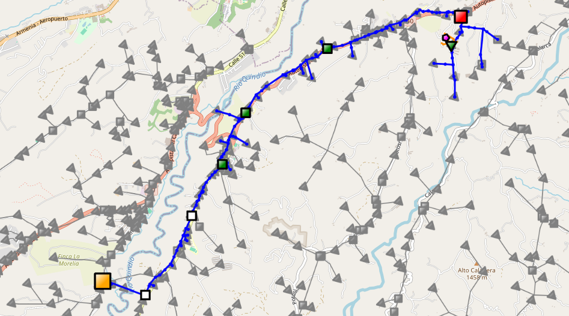
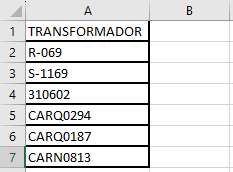
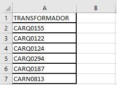
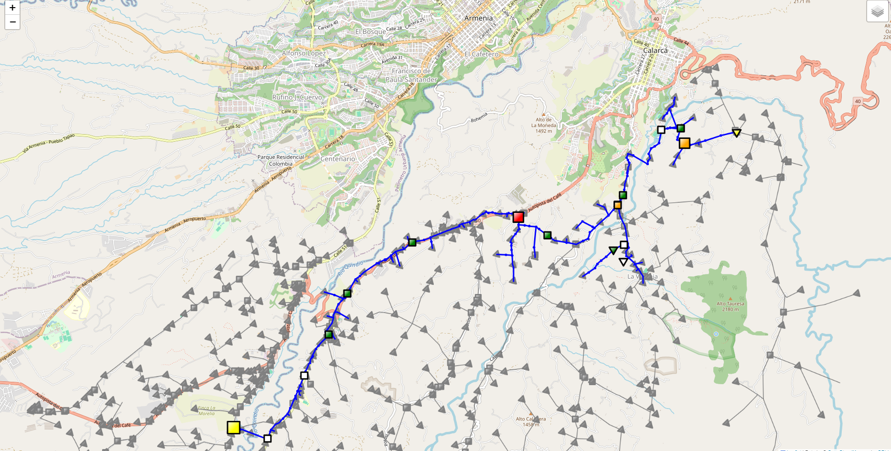

# Análisis de fallas 


<!-- vscode-markdown-toc -->
* 1. [Project Structure](#ProjectStructure)
* 2. [Installation](#Installation)
* 3. [Usage](#Usage)
	* 3.1. [Input](#Input)
	* 3.2. [Example](#Example)
* 4. [Source Code Structure (src/)](#SourceCodeStructuresrc)
* 5. [Additional Information](#AdditionalInformation)
* 6. [Author](#Author)

<!-- vscode-markdown-toc-config
	numbering=true
	autoSave=true
	/vscode-markdown-toc-config -->
<!-- /vscode-markdown-toc -->

This project focuses on identifying components that have experienced the most failures throughout a power distribution network. This is achieved by analyzing components that extend from the analysis point to the electrical substation that feeds them. To achieve this goal, a combination of data obtained from the database and SCADA system distribution event reports is employed. This information is interactively presented on a map using the Folium library.

On the generated map, size and color indicators are used to represent the events that have occurred at each circuit component. This visual representation allows for quick and intuitive identification of elements that have a significant impact on the failures perceived by the study element. It also facilitates decision-making and corrective action planning.

Below is an example of the map, which shows an electrical circuit displaying the path between the substation, various switching elements, and network sections up to a transformer that ultimately feeds a particular user. On the map, the following information can be identified:

 - The pink pentagon represents the user on which the analysis is to be performed.
 - Red square: Represents the system element that has experienced the most failures along the path.
 - Yellow square: Represents the electrical substation.
 - Green squares: Represent the switching elements of the system that have experienced certain failures along the path.
 - White squares: Represent the switching elements that have not experienced any failures.

**Figure 1:** Example Map Visualization
    

##  1. <a name='ProjectStructure'></a>Project Structure
1. **project_root**: Main directory of the project.
    - **data**: Contains data sets.
        - **raw**: Datos sin procesar (Originales).
    - **references**: Manuals and explanatory material.
        - **structure proyect**: General project structure in plain text file.
        - **requirements.txt:**: List of project dependencies, it's a .py file that allows installing libraries in the appropriate version to run the project properly.
    - **src**: Source code of the project.
        - `Main_analisis_falla.py:` Main script to execute the project.
        - **data** 
            - `load_data.py`: Functions to load data from various sources.
            - `clean_data.py`: Functions to perform data cleaning and preprocessing.
        - **analysis**
            - `analysis.py`: Functions to perform data analysis.
        - **visualization**
            - `generate_map.py`: Functions to generate an interactive map.
    - **reports:** HTML map and Excel reports.
    - **README.md:** Main project documentation in english.
    - **README_ES.md:** Main project documentation in spanish.


##  2. <a name='Installation'></a>Installation

To start using this project, follow these steps::

1. **Clone the repository:**
   - Run the following command to clone the repository from GitHub:
     ```bash
     git clone https://github.com/Zarcasmo/PowerGeoInsight-Comprehensive_Analysis_of_Electrical_Grid_Failures.git
     ```
2. **Navigate to the project directory:**
   - Use the `cd` command to navigate to the newly cloned directory:
     ```bash
     cd PowerGeoInsight-Comprehensive_Analysis_of_Electrical_Grid_Failures
     ```
3. **Create a new working environment:**
   - It is recommended to create a new working environment for this project to avoid conflicts with dependencies from other projects. You can create a new environment using virtualenv or conda:
     - With virtualenv:
       ```bash
       virtualenv nombre_del_entorno
       ```
     - With conda:
       ```bash
       conda create --name nombre_del_entorno
       ```
4. **Activate the working environment:**
   - Once the environment is created, activate it using the following command:
     - For virtualenv:
       ```bash
       source nombre_del_entorno/bin/activate
       ```
     - For conda:
       ```bash
       conda activate nombre_del_entorno
       ```       
5. **Install dependencies:**
   - Run the following command to install project dependencies using pip and the requirements.txt file:
     ```bash
     pip install -r requirements.txt
     ```

##  3. <a name='Usage'></a>Usage
###  3.1. <a name='Input'></a>Input
- **`Console Input`**
  1. Run the main script `Main_analisis_falla.py`. 
  2. Now, you are prompted to enter a value.
        ```python
        Enter a value: 
        ```    
  3. You can enter a single value.
     - Transformer type input.
        ```python
        Enter a value: CARQ0122
        Processing a single value: CARQ0122
        ``` 
        After entering the code, it will display a message indicating that a single value is being processed.

     - Switching element type input.
        ```python
        Enter a value: S-1169
        Processing a single value: S-1169
        ```  
        After entering the code, it will display a message indicating that a single value is being processed.

     - User type input.
        ```python
        Enter a value: 310602
        Processing a single value: 310602
        ```  
        After entering the ID of a user, it will display a message indicating that a single value is being processed.
   4. You can enter a list of values.
        ```python
        Enter a value: CARQ0122,S-1169,310602
        Processing list_ of values: ['CARQ0122', 'S-1169', '310602']
        ```    


- **`Reading xlsx file`**

  For the input to be the Excel file, you must take into account the following considerations.

  1. Update the input file, which is located in the path `data/raw/entrada.xlsx`.
  2. The file must have a single column with a 'TRANSFORMER' header.

        

        **Note:** Although the column is called 'TRANSFORMER' you can enter different types of elements.
  
  3. When you run the main script, do not enter values ​​and press **Enter**.
        ```python
        Enter a value:
        Processing an excel file
        ```

###  3.2. <a name='Example'></a>Example
- **`Input:`** There is a set of transformers in an xlsx file.

    
- **`Execution:`** the main script  `Main_analisis_falla.py`

  Since the input is an xlsx file, You should not enter values ​​in the console

    ```python
    Enter a value:
    Processing an excel file
    ``` 
- **`Output:`** 

  When the execution finishes, the output will be one or more html maps and xlsx files that contain information of interest.

  **xlsx documents**

  The documents are generated in the `analysis.py` module and stored in `data/processed`.
  - `consulta_aperturas_filtradada.xlsx`: this document contains the information on the total exit events for all the elements of the trajectory.
  - `reporte_eventos.xlsx`: contains the events obtained from the MAR reporter.
  - `eventos_funcion.xlsx`: this document contains the events obtained from MAR once the function has been applied to it. `filter_dates`
  - `informacion.xlsx`: contains the sum of the openings for each of the elements of the trajectory.

  **html map**

  - The map is generated in the `generate_map.py` module and stored in `reports`.
  - The number of maps is equal to the number of different circuits.
  - The html map will look like this:

    **Figure  2:** Example of a map display.
    


##  4. <a name='SourceCodeStructuresrc'></a>Source Code Structure (src/)
1. **__init__.py:** Package initialization file.

 - This file is used to make Python recognize the folders as a module of the package. It does not contain specific code or additional functionality.

2. **Main_analysis_failure.py** Main script
   - This module serves as the main entry point for the fault analysis program, importing functions from the analysis and data modules (load_data and clear_data) to process user input, filter data and perform fault analysis.
      - **get_user_input:** Function that requests user input and returns the entered value.

3. **load_data.py**
   - This script loads data from different sources, including CSV files and an Oracle database.
        - **process_input:** Function that processes the input value and returns a structured DataFrame.
        - **Load CSV data:** This code block loads data from CSV files located in the `data/raw/` folder.
        - **Connection to Databases:** This code block attempts to establish a connection to an Oracle database and, if the connection fails, loads data from CSV files located in the `data/raw/` folder.

4. **clear_data.py:** Functions for data cleaning
   - This script contains functions to clean and process data before further analysis.
        - **filter_dates:** Function that filters event dates based on the Gaussian distribution of energization dates.

5. **analysis.py:** Failure analysis functions.
   - This module contains the function `analysis_failures`, which performs a comprehensive analysis of failures in a set of elements of the electrical system, using information provided in various DataFrames.
        - **failure_analysis:** Function that performs failure analysis in an electrical circuit.
        - **search_value:** Function that searches the value of 'FID_EQUIPO_PADRE' recursively for a given 'valor_funcio' within a DataFrame 'gelemet'.
        - **Search_value function call:** This code block calls the buscar_valor function to search for specific values ​​in various data sets (usuarios, trafos_original y gelemet). The search result is stored in the found_values ​​list, and errors are handled to handle cases where the values ​​are not found in any of the data sets.
        - **DataFrames to graph the trajectory:** This code block obtains the GeoDataFrames for the elements associated with the FIDs obtained with the `buscar_valor` function.
        - **Search and filtering of elements by substation:** This code block performs the search and filtering of elements related to a specific substation, identified by the values ​​found in the found_values ​​list.
        - **Transformer-node openings:** This code block performs opening processing (nodo-trasformador) for the elements of the electrical network, using information from the data frames trafo, cortes, and consulta_aperturas.
        - **Event Report Openings:** This code block processes openings and generates reports based on the data of the reported events and the elements of the electrical network. Various filtering, combining, and calculating operations are performed to obtain detailed statistics on item openings. Finally, a report is generated in Excel format that contains the processed information and is stored in `../data/processed`.


6. **generate_map.py:** Functions to generate interactive map.
   - This module provides functions to generate an interactive HTML map that displays different layers of geospatial information, such as cutting elements, transformers, electrical networks, users, among others.
        - **tipo_punto:** Function that draws point-type markers on an interactive map.
        - **tipo_linea:** Function that draws line-type markers on an interactive map.
        - **agregar_marcador:** Function that adds markers to a map layer based on specific information from the DataFrame.
        - **Graficar trayectoria:** This code block calls the previously defined functions (`tipo_linea` and `tipo_punto`) to add different feature layers to an interactive map using the Folium library.
            - **Graficar red MT:** Adds the lines that make up the MT network to the interactive map with a specific color and a defined thickness.
            - **Graficar elementos de corte:** Adds cut feature markers to the corresponding layer of the interactive map with specific colors and sizes based on the feature type.
            - **Graficar Transformadores:** Adds transformer markers to the corresponding layer of the interactive map with a defined color, size and shape.
            - **Graficar red BT:** Adds the lines that make up the BT network to the interactive map with a specific color and a defined thickness.
            - **Graficar usuarios:** Adds user markers to the corresponding layer of the interactive map with a defined color, size and shape.

        - **Graficar el SDL:** This code block calls the `line_type` and `point_type` functions to add SDL lines, cut elements and transformers to an interactive map using the Folium library.
        - **Graficar por REPORTE-EVENTOS:** This code block creates three layers in an interactive map, each dedicated to different types of events related to full and partial openings.
          - **Graficar elementos de corte:** Adds markers for cut elements to three different layers on the interactive map: total openings, partial node-transformer openings and partial openings by events.
          - **Graficar Transformadores:** Add markers for transformers to the same three layers in the interactive map, with the same purpose of showing total openings, partial node-transformer openings and partial openings by events.
        - **Mapa HTML:** Code block to add the layers to the interactive map, include layer control, save the map as an HTML file in the `../reports/` folder and open it in the web browser.

##  5. <a name='AdditionalInformation'></a>Additional Information
- [Official Folium Documentation](https://python-visualization.github.io/folium/)
- [GitHub Markdown Guide](https://docs.github.com/es/github/writing-on-github/basic-writing-and-formatting-syntax)


##  6. <a name='Author'></a>Author
 - Andrea Bartolo Guarin - andrea.bartolo@utp.edu.co
 - Alejandro López Aguirre - alejo97100@utp.edu.co
