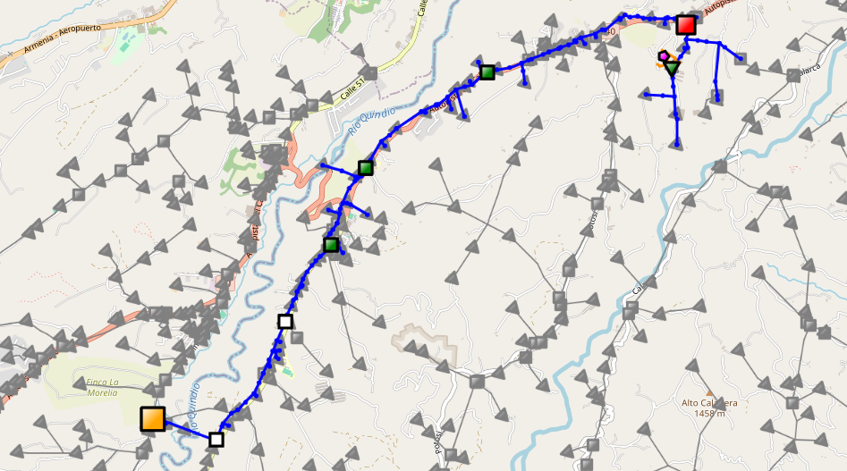

# Análisis de fallas 

<!-- vscode-markdown-toc -->
* 1. [Estructura del Proyecto](#EstructuradelProyecto)
* 2. [Instalación](#Instalacin)
* 3. [Uso](#Uso)
	* 3.1. [Entrada](#Entrada)
	* 3.2. [Ejemplo](#Ejemplo)
* 4. [Estructura del Código Fuente (src/)](#EstructuradelCdigoFuentesrc)
* 5. [Información Adicional](#InformacinAdicional)
* 6. [Autor](#Autor)

<!-- vscode-markdown-toc-config
	numbering=true
	autoSave=true
	/vscode-markdown-toc-config -->
<!-- /vscode-markdown-toc -->


Este proyecto se enfoca en identificar los componentes que han experimentado más fallas a lo largo de una red de distribución de energía. Esto se logra analizando los componentes que se extienden desde el punto de análisis hasta la subestación eléctrica que los alimenta. Para alcanzar este objetivo, se emplea una combinación de datos obtenidos de la base de datos y reportes de eventos del SCADA del sistema de distribución. Esta información se presenta de manera interactiva en un mapa utilizando la librería Folium.

En el mapa generado, se utilizan indicadores de tamaño y color para representar los eventos ocurridos en cada componente del circuito. Esta representación visual permite una identificación rápida e intuitiva de los elementos que tienen un impacto significativo en las fallas percibidas por el elemento de estudio. Asimismo, facilita la toma de decisiones y la planificación de acciones correctivas.

A continuación, se muestra un ejemplo del mapa, donde se visualiza un circuito eléctrico que muestra la trayectoria entre la subestación, los diferentes elementos de corte y los tramos de red hasta un transformador que finalmente alimenta a un usuario en particular. En el mapa, se puede identificar la siguiente información:

 - El pentágono de color rosado representa el usuario sobre el cual se quiere realizar el análisis.
 - Cuadro de color rojo: Representa el elemento del sistema que ha experimentado más fallas en la trayectoria.
 -  Cuadro de color amarillo: Representa la subestación eléctrica.
 - Cuadros de color verde: Representan los elementos de corte del sistema que han presentado ciertas fallas en la trayectoria.
 - Cuadros de color blanco: Representan los elementos de corte que no han experimentado ninguna falla.


### Figura 1: Ejemplo de visualización del mapa


##  1. <a name='EstructuradelProyecto'></a>Estructura del Proyecto
1. **project_root**: Directorio principal del proyecto.
    - **data**: Contiene los conjuntos de datos.
        - **raw**: Datos sin procesar (Originales).
        - **processed**: Datos procesados.
    - **references**: Manuales y material explicatorio.
        - **structure proyect**: Estructrua general del proyecto en archivo plano.
        - **requirements.txt:**: Lista de dependencias del proyecto, .py que permite instalar las librerias en la versión adecuada para ejecutar el proyecto de manera adecuada.
    - **src**: Código fuente del proyecto.
        - `Main_analisis_falla.py:` Script principal para ejecutar el proyecto.
        - **data** 
            - `load_data.py`: Funciones para cargar datos desde diversas fuentes.
            - `clean_data.py`: Funciones para realizar limpieza y preprocesamiento de los datos.
        - **analysis**
            - `analysis.py`: Funciones para realizar el analisis de los datos.
        - **visualization**
            - `generate_map.py`: Funciones para generar un mapa interactivo
    - **reports:** mapa en HTML.
    - **README.md:** Documentación principal del proyecto.


##  2. <a name='Instalacin'></a>Instalación
Para comenzar a utilizar este proyecto, sigue estos pasos:

1. **Clona el repositorio:**
   - Ejecuta el siguiente comando para clonar el repositorio desde GitHub:
     ```bash
     git clone https://github.com/Zarcasmo/PowerGeoInsight-Comprehensive_Analysis_of_Electrical_Grid_Failures.git
     ```
2. **Ve al directorio del proyecto:**
   - Utiliza el comando `cd` para navegar hasta el directorio recién clonado:
     ```bash
     cd PowerGeoInsight-Comprehensive_Analysis_of_Electrical_Grid_Failures
     ```
3. **Crea un nuevo ambiente de trabajo:**
   - Se recomienda crear un nuevo entorno de trabajo para este proyecto para evitar conflictos con las dependencias de otros proyectos. Puedes crear un nuevo entorno usando virtualenv o conda:
     - Con virtualenv:
       ```bash
       virtualenv nombre_del_entorno
       ```
     - Con conda:
       ```bash
       conda create --name nombre_del_entorno
       ```
4. **Activa el ambiente de trabajo:**
   - Una vez que se haya creado el ambiente, actívalo utilizando el siguiente comando:
     - Para virtualenv:
       ```bash
       source nombre_del_entorno/bin/activate
       ```
     - Para conda:
       ```bash
       conda activate nombre_del_entorno
       ```       
5. **Instala las dependencias:**
   - Ejecuta el siguiente comando para instalar las dependencias del proyecto utilizando pip y el archivo requirements.txt:
     ```bash
     pip install -r requirements.txt
     ```

##  3. <a name='Uso'></a>Uso
###  3.1. <a name='Entrada'></a>Entrada
- **`Entrada por consola`**
  1. Ejecutar el script principal `Main_analisis_falla.py` 
  2. Ahora se le pide que ingrese un valor.
        ```python
        Ingrese un valor: 
        ```    
  3. Puede ingresar un solo valor.
     - Entrada tipo transformador.
        ```python
        Ingrese un valor: CARQ0122
        Procesando un solo valor: CARQ0122
        ``` 
        Despues de ingresar el código le mostrará un mensaje indicando que se esta porcesando un solo valor. 

     - Entrada tipo elemento de corte.
        ```python
        Ingrese un valor: S-1169
        Procesando un solo valor: S-1169
        ```  
        Despues de ingresar el código le mostrará un mensaje indicando que se esta porcesando un solo valor.

     - Entrada tipo usuario.
        ```python
        Ingrese un valor: 310602
        Procesando un solo valor: 310602
        ```  
        Despues de ingresar el NIU de un usaurio le mostrará un mensaje indicando que se esta porcesando un solo valor.
   4. Puede ingresar una lista de valores.
        ```python
        Ingrese un valor: CARQ0122,S-1169,310602
        Procesando lista de valores: ['CARQ0122', 'S-1169', '310602']
        ```    

- **`Lectura de archivo xlsx`**

  Para que la entrada sea el archivo de excel debe tener en cuenta las siguientes consideraciones.

  1. Actualizar el archivo de entrada, el cual se encuentra en la ruta `data/raw/entrada.xlsx`. 
  2. El archivo debe tener una sola columna con un encabezado 'TRANSFORMADOR'.

        

        **Nota:** Aunque la columna se llama 'TRANSFORMADOR' puede ingresar diferentes tipos de elementos.
  
  3. Cuando ejecute el script principal, no ingrese valores y pulse **Enter**.
        ```python
        Ingrese un valor: 
        Procesando un archivo excel
        ```     

###  3.2. <a name='Ejemplo'></a>Ejemplo
- **`Entrada:`** Se tiene un conjunto de transformadores en un archivo xlsx.

    
- **`Ejecución:`** se ejecuta el script principal `Main_analisis_falla.py`

  Como la entrada es un archivo xlsx, no debo ingresar valores en la consola

    ```python
    Ingrese un valor: 
    Procesando un archivo excel
    ``` 
- **`Salida:`** 

  Cuando termine la ejecución se tiene como salida uno o varios mapas en html y archivos xlsx que contienen información de interés. 

  **documentos xlsx**

    Los documentos se generan en el módulo `analysis.py` y se almacenan en `data/processed`.
  - `consulta_aperturas_filtradada.xlsx`: este documento contiene la información de los eventos de salidas totales  para todos los elementos de la trayectoria.
  - `reporte_eventos.xlsx`: contiene los eventos obtenidos del reporteador de MAR.
  - `eventos_funcion.xlsx`: este documento contiene los eventos obtenidos de MAR una vez se le ha aplicado la función. `filtrar_fechas` 
  - `informacion.xlsx`: contiene la suma de las aperturas para cada uno de los elementos de la trayectoria.

  **mapa html**

  - El mapa se genera en el módulo `generate_map.py` y se almacena en `reports`.
  - La cantidad de mapas es igual a la cantidad de circuitos diferentes.
  - El mapa html se vera de la siguiente manera:

    **Figura 2:** Ejemplo de visualización de un mapa
    


##  4. <a name='EstructuradelCdigoFuentesrc'></a>Estructura del Código Fuente (src/)
1. **__init__.py:** Archivo de inicialización del paquete.
   - Este archivo se utiliza para que Python reconozca las carpetas como un módulo del paquete. No contiene código específico ni funcionalidades adicionales.

2. **Main_analisis_falla.py** Script principal
   -  Este módulo sirve como punto de entrada principal para el programa de      análisis de fallas, importa funciones de los módulos analysis y data(load_data y clear_data) para procesar la entrada del usuario, filtrar datos y realizar el análisis de fallas.
      - **obtener_entrada_usuario:** Función que solicita la entrada del usuario y devuelve el valor ingresado.

3. **load_data.py** 
   -  Este script carga datos desde diferentes fuentes, incluyendo archivos CSV y una base de datos Oracle.
        - **procesar_entrada:** Función que procesa el valor de entrada y devuelve un DataFrame estructurado. 
        - **Cargar datos CSV:** Este bloque de código carga datos desde archivos CSV ubicados en la carpeta `data/raw/`.
        - **Conexión a bases de Datos:** Este bloque de código intenta establecer una conexión a una base de datos Oracle y, si la conexión falla, carga datos desde archivos CSV ubicados en la carpeta `data/raw/`.

4. **clear_data.py:** Funciones para limpieza de datos
   - Este script contiene funciones para limpiar y procesar datos antes de su análisis posterior.
        - **filtrar_fechas:** Función que filtra las fechas de eventos basándose en la distribución gaussiana de las fechas de energización. 

5. **analysis.py:** Funciones de análisis de fallas.
   - Este módulo contiene la función `analisis_fallas`, la cual realiza un análisis integral de fallas en un conjunto de elementos del sistema eléctrico, utilizando información proporcionada en diversos DataFrames.
        - **analisis_fallas:** Función que realiza el análisis de fallas en un circuito eléctrico.
        - **buscar_valor:** Función que busca el valor de 'FID_EQUIPO_PADRE' de forma recursiva para un 'valor_funcion' dado dentro de un DataFrame 'gelemet'.
        - **Llamado a la función buscar_valor.:** Este bloque de código llama a la función buscar_valor para buscar valores específicos en varios conjuntos de datos (usuarios, trafos_original y gelemet). El resultado de la búsqueda se almacena en la lista valores_encontrados, y se manejan errores para manejar los casos en los que los valores no se encuentran en ninguno de los conjuntos de datos.
        - **DataFrames para graficar la trayactoria:** Este bloque de código obtiene los GeoDataFrames para los elementos asociados a los FID obtenidos con la función `buscar_valor`. 
        - **Búsqueda y filtrado de elementos por subestación:** Este bloque de código realiza la búsqueda y filtrado de elementos relacionados con una subestación específica, identificada por los valores encontrados en la lista valores_encontrados.
        - **Aperturas nodo-transformador:** Este bloque de código realiza un procesamiento de aperturas(nodo-trasformador) para los elementos de la red eléctrica, utilizando información de los DataFrames trafo, cortes, y consulta_aperturas.
        - **Aperturas reporteEventos :** Este bloque de código realiza el procesamiento de aperturas y genera informes a partir de los datos de los eventos reportados y los elementos de la red eléctrica. Se llevan a cabo diversas operaciones de filtrado, combinación y cálculo para obtener estadísticas detalladas sobre las aperturas de los elementos. Finalmente, se genera un informe en formato Excel que contiene la información procesada y que se almacena en `../data/processed`.

6. **generate_map.py:** Funciones para generar mapa interactivo
   - Este módulo proporciona funciones para generar un mapa interactivo HTML que visualiza diferentes capas de información geoespacial, como elementos de co  rte, transformadores, redes eléctricas MT y BT, usuarios, entre otros.
        - **tipo_punto:** Función que dibuja marcadores tipo punto en un mapa interactivo. 
        - **tipo_linea:** Función que dibuja marcadores tipo línea en un mapa interactivo.        
        - **agregar_marcador:** Función que agrega marcadores a una capa del mapa basándose en información específica del DataFrame.
        - **Graficar trayectoria:** Este bloque de código llama las funciones previamente definidas(`tipo_linea` y `tipo_punto`) para agregar diferentes capas de elementos a un mapa interactivo utilizando la biblioteca Folium.
            - **Graficar red MT:**  Agrega las líneas que componen la red MT al mapa interactivo con un color específico y un grosor definido. 
            - **Graficar elementos de corte:** Agrega marcadores de elementos de corte a la capa correspondiente del mapa interactivo con colores y tamaños específicos según el tipo de elemento.
            - **Graficar Transformadores:** Agrega marcadores de transformadores a la capa correspondiente del mapa interactivo con un color, tamaño y forma definidos.
            - **Graficar red BT:** Agrega las líneas que componen la red BT al mapa interactivo con un color específico y un grosor definido.
            - **Graficar usuarios:** Agrega marcadores de usuarios a la capa correspondiente del mapa interactivo con un color, tamaño y forma definidos.
        - **Graficar el SDL:** Este bloque de código llama las funciones `tipo_linea` y `tipo_punto` para agregar líneas del SDL, elementos de corte y transformadores a un mapa interactivo utilizando la biblioteca Folium.
        - **Graficar por REPORTE-EVENTOS:** Este bloque de código crea tres capas en un mapa interactivo, cada una dedicada a diferentes tipos de eventos relacionados con aperturas totales y parciales.
            - **Graficar cortes:**  Agrega marcadores para elementos de corte a tres capas diferentes en el mapa interactivo: aperturas totales, aperturas parciales nodo-transformador y aperturas parciales por eventos.
            - **Graficar Transformadores:** Agrega marcadores para transformadores a las mismas tres capas en el mapa interactivo, con el mismo propósito de mostrar aperturas totales, aperturas parciales nodo-transformador y aperturas parciales por eventos.
        - **mapa HTML:** Bloque de código para agregar las capas al mapa interactivo, incluir control de capas, guardar el mapa como un archivo HTML en la carpeta `../reports/` y abrirlo en el navegador web.


##  5. <a name='InformacinAdicional'></a>Información Adicional
- [Documentación oficial de Folium](https://python-visualization.github.io/folium/)
- [Guía de Markdown de GitHub](https://docs.github.com/es/github/writing-on-github/basic-writing-and-formatting-syntax)


##  6. <a name='Autor'></a>Autor
 - Andrea Bartolo Guarin - andrea.bartolo@utp.edu.co
 - Alejandro López Aguirre - alejo97100@utp.edu.co
