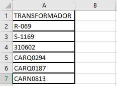

# Manual de Usuario: Análisis de fallas
## Tabla de Contenido

<details>
  <summary><b><a href="#instalación">1. Instalación</a></b></summary>

  <!-- Elemento vacío para mantener la alineación -->
  <div></div>
</details>

<details>
  <summary><b><a href="#uso">2.Uso</a></b></summary>

  - [Entrada](#entrada)
  - [Ejemplo](#ejemplos-avanzados)
</details>

<details>
  <summary><b><a href="#documentacion">3. Documentación de Archivos y Funciones</a></b></summary>

  - [Main_analisis_falla.py](#main)
  - [load_data.py](#load-data)
  - [clear_data.py](#clear-data)
  - [analysis.py](#analysis)
  - [generate_map.py](#generate-map)
</details>


## Instalación <a id="instalación"></a>

Para comenzar a utilizar este proyecto, sigue estos pasos:

1. **Clona el repositorio:**
   - Ejecuta el siguiente comando para clonar el repositorio desde GitHub:
     ```bash
     git clone https://github.com/AndreaB2/Analisis_falla_folium.git
     ```
2. **Ve al directorio del proyecto:**
   - Utiliza el comando `cd` para navegar hasta el directorio recién clonado:
     ```bash
     cd Analisis_falla_folium
     ```
3. **Crea un nuevo ambiente de trabajo:**
   - Se recomienda crear un nuevo entorno de trabajo para este proyecto para evitar conflictos con las dependencias de otros proyectos. Puedes crear un nuevo entorno usando virtualenv o conda:
     - Con virtualenv:
       ```bash
       virtualenv nombre_del_entorno
       ```
     - Con conda:
       ```bash
       conda create --name nombre_del_entorno
       ```
4. **Activa el ambiente de trabajo:**
   - Una vez que se haya creado el ambiente, actívalo utilizando el siguiente comando:
     - Para virtualenv:
       ```bash
       source nombre_del_entorno/bin/activate
       ```
     - Para conda:
       ```bash
       conda activate nombre_del_entorno
       ```       
5. **Instala las dependencias:**
   - Ejecuta el siguiente comando para instalar las dependencias del proyecto utilizando pip y el archivo requirements.txt:
     ```bash
     pip install -r requirements.txt
     ```

## Uso <a id="uso"></a>

### Entrada <a id="entrada"></a>
- **`Entrada por consola`**
  1. Ejecutar el script principal `Main_analisis_falla.py` 
  2. Ahora se le pide que ingrese un valor.
        ```python
        Ingrese un valor: 
        ```    
  3. Puede ingresar un solo valor.
     - Entrada tipo transformador.
        ```python
        Ingrese un valor: CARQ0122
        Procesando un solo valor: CARQ0122
        ``` 
        Despues de ingresar el código le mostrará un mensaje indicando que se esta porcesando un solo valor. 

     - Entrada tipo elemento de corte.
        ```python
        Ingrese un valor: S-1169
        Procesando un solo valor: S-1169
        ```  
        Despues de ingresar el código le mostrará un mensaje indicando que se esta porcesando un solo valor.

     - Entrada tipo usuario.
        ```python
        Ingrese un valor: 310602
        Procesando un solo valor: 310602
        ```  
        Despues de ingresar el NIU de un usaurio le mostrará un mensaje indicando que se esta porcesando un solo valor.
   4. Puede ingresar una lista de valores.
        ```python
        Ingrese un valor: CARQ0122,S-1169,310602
        Procesando lista de valores: ['CARQ0122', 'S-1169', '310602']
        ```    

- **`Lectura de archivo xlsx`**

  Para que la entrada sea el archivo de excel debe tener en cuenta las siguientes consideraciones.

  1. Actualizar el archivo de entrada, el cual se encuentra en la ruta `data/raw/entrada.xlsx`. 
  2. El archivo debe tener una sola columna con un encabezado 'TRANSFORMADOR'.

        

        **Nota:** Aunque la columna se llama 'TRANSFORMADOR' puede ingresar diferentes tipos de elementos.
  
  3. Cuando ejecute el script principal, no ingrese valores.
        ```python
        Ingrese un valor: 
        Procesando un archivo excel
        ```     

### Ejemplo <a id="ejemplos-avanzados"></a>
- **`Entrada:`** Se tiene un conjunto de transformadores en un archivo xlsx.

    
- **`Ejecución:`** se ejecuta el script principal `Main_analisis_falla.py`

  Como la entrada es un archivo xlsx, no debo ingresar valores en la consola

    ```python
    Ingrese un valor: 
    Procesando un archivo excel
    ``` 
- **`Salida:`** 

  Cuando termine la ejecución se tiene como salida uno o varios mapas en html y archivos xlsx que contienen información de interés. 

  **documentos xlsx**

    Los documentos se generan en el módulo `analysis.py` y se almacenan en `data/processed`.
  - `consulta_aperturas_filtradada.xlsx`: este documento contiene la información de los eventos de salidas totales  para todos los elementos de la trayectoria.
  - `reporte_eventos.xlsx`: contiene los eventos obtenidos del reporteador de MAR.
  - `eventos_funcion.xlsx`: este documento contiene los eventos obtenidos de MAR una vez se le ha aplicado la función. `filtrar_fechas` 
  - `informacion.xlsx`: contiene la suma de las aperturas para cada uno de los elementos de la trayectoria.

  **mapa html**

  - El mapa se genera en el módulo `generate_map.py` y se almacena en `reports`.
  - La cantidad de mapas es igual a la cantidad de circuitos diferentes.
  - El mapa html se ve de la siguiente manera:
  


## Documentación de Archivos y Funciones <a id="documentacion"></a>

En esta sección, se proporciona documentación detallada sobre los archivos y funciones principales del proyecto.

### `Main_analisis_falla.py` <a id="main"></a>

Este módulo sirve como punto de entrada principal para el programa de análisis de fallas. Importa funciones
de los módulos analysis y data (load_data y clear_data) para procesar la entrada del usuario, filtrar datos y realizar
el análisis de fallas.


- **`obtener_entrada_usuario()`**

    - Función que solicita la entrada del usuario y devuelve el valor ingresado.

    **Returns:**
    - `entrada_usuario` (*str*): Valor ingresado por el usuario.


<details>
<summary><b>Ver código fuente</b></summary>

```python

def obtener_entrada_usuario():
    """
    Función que solicita la entrada del usuario y devuelve el valor ingresado.

    Returns:
        str: Valor ingresado por el usuario.
    """
    # Pide una entrada al usuario
    # Valores de ejemplo CARQ0155,CARQ0122,CARQ0124
    entrada_usuario =input("Ingrese un valor: ")
    return entrada_usuario
```    
</details>


### `load_data.py` <a id="load-data"></a>
Este script carga datos desde diferentes fuentes, incluyendo archivos CSV y una base de datos Oracle.

Primero, define una función para procesar la entrada y devuelve un DataFrame estructurado. Esta función
acepta diferentes tipos de entrada, como archivos Excel, listas o valores individuales.

Luego, carga los datos principales, incluyendo elementos principales, transformadores, usuarios y datos de red.
Si hay problemas de conexión a la base de datos Oracle, el script carga datos desde archivos CSV locales.
Los datos se filtran según un rango de fechas especificado.

Finalmente, se realizan algunas operaciones de limpieza y procesamiento de datos, como renombrar columnas,
dar formato a fechas y manejar valores faltantes.

- **`procesar_entrada(entrada)`**

    Función que procesa el valor de entrada y devuelve un DataFrame estructurado.

    **Parameters:**
    - `entrada` (*str*,*list*): Valor de entrada a procesar.

    **Returns:**

    - `valor_entrada` (*pd.DataFrame*): DataFrame con columnas "TRANSFORMADOR" y, posiblemente, "circuito".

    **Notes:**

    Esta función acepta diferentes tipos de entrada (archivo Excel, lista o valor individual)
    y adapta la estructura del DataFrame resultante en consecuencia.

    **Ejemplos de Uso:**

    - procesar_entrada(`entrada.xlsx`)
    - procesar_entrada(`['CARQ0122', 'S-1169', '310602']`)
    - procesar_entrada(`'310602'`) 
  


  <details>
   <summary><b>Ver código fuente</b></summary>

    ```python
    # Contenido del archivo calculadora.py
    def procesar_entrada(entrada):
        """
        Función que procesa el valor de entrada y devuelve un DataFrame estructurado.

        Parameters
        ----------
        entrada : str, list
            Valor de entrada a procesar.

        Returns
        -------
        valor_entrada : pd.DataFrame
            DataFrame con columnas "TRANSFORMADOR" y, posiblemente, "circuito".

        Notes
        -----
        Esta función acepta diferentes tipos de entrada (archivo Excel, lista o valor individual)
        y adapta la estructura del DataFrame resultante en consecuencia.

        Ejemplos de Uso:
        - procesar_entrada("archivo.xlsx")
        - procesar_entrada([1, 2, 3])
        - procesar_entrada("123") 
        """
        # Crear un DataFrame vacío con columnas predeterminadas
        valor_entrada = pd.DataFrame(columns=["TRANSFORMADOR"])
        # Comprobar el tipo de entrada y realizar las operaciones correspondientes
        if not entrada:
            try:
                # Intentar cargar un archivo Excel cuando no se ingresa valor de entrada
                archivo_excel = "../data/raw/entrada.xlsx"
                valor_entrada = pd.read_excel(archivo_excel,sheet_name="206-22")
                valor_entrada['circuito'] = valor_entrada['TRANSFORMADOR'].map(trafos_original.set_index('CODIGO')['CIRCUITO'])
                # If there are still missing values, fill them using corte_original
                valor_entrada['circuito'] = valor_entrada['circuito'].fillna(valor_entrada['TRANSFORMADOR'].map(corte_original.set_index('CODIGO')['CIRCUITO']))
                # If there are still missing values, fill them using usuarios
                valor_entrada['circuito'] = valor_entrada['circuito'].fillna(valor_entrada['TRANSFORMADOR'].map(usuarios.set_index('NIU')['CIRCUITO']))
                            
                print("Procesando un archivo excel")
            except Exception as e:
                print(f"Error al cargar el archivo Excel: {e}")
        elif isinstance(entrada, list):
            print(f"Procesando lista de valores: {entrada}")
            valor_entrada["TRANSFORMADOR"] = entrada
        
        elif "," in entrada:
            # Divide la cadena en una lista de valores utilizando la coma como separador
            lista_valores = [valor.strip() for valor in entrada.split(',')]
            print(f"Procesando lista de valores: {lista_valores}")
            # Asegúrate de que la columna 'TRANSFORMADOR' contenga valores adecuadamente tipados
            for i, valor in enumerate(lista_valores):
                if valor[0].isdigit() or (valor[0] == '-' and len(valor) > 1 and valor[1].isdigit()):
                    # Si el primer carácter es un dígito o un signo negativo seguido de un dígito, conviértelo a float
                    lista_valores[i] = float(valor)
                else:
                    # De lo contrario, déjalo como string
                    lista_valores[i] = valor
        
            # Asigna la lista a la columna 'TRANSFORMADOR'
            valor_entrada['TRANSFORMADOR'] = lista_valores
            
            #valor_entrada["circuito"] =''
            # Crear la nueva columna 'CIRCUITO' en df_principal
            valor_entrada['circuito'] = valor_entrada['TRANSFORMADOR'].map(trafos_original.set_index('CODIGO')['CIRCUITO'])
            # If there are still missing values, fill them using corte_original
            valor_entrada['circuito'] = valor_entrada['circuito'].fillna(valor_entrada['TRANSFORMADOR'].map(corte_original.set_index('CODIGO')['CIRCUITO']))
            # If there are still missing values, fill them using usuarios
            valor_entrada['circuito'] = valor_entrada['circuito'].fillna(valor_entrada['TRANSFORMADOR'].map(usuarios.set_index('NIU')['CIRCUITO']))
                
        else:
            print(f"Procesando un solo valor: {entrada}")
            # Asegúrate de que la columna 'TRANSFORMADOR' contenga valores adecuadamente tipados
            if entrada.isdigit() or (entrada[0] == '-' and len(entrada) > 1 and entrada[1].isdigit()):
                # Si el valor es un dígito o un signo negativo seguido de un dígito, conviértelo a float
                valor_entrada.loc[0, "TRANSFORMADOR"] = float(entrada)
            else:
                # De lo contrario, déjalo como string
                valor_entrada.loc[0, "TRANSFORMADOR"] = entrada  
            # Crear la nueva columna 'circuito' en el DataFrame valor_entrada   
            valor_entrada['circuito'] = valor_entrada['TRANSFORMADOR'].map(trafos_original.set_index('CODIGO')['CIRCUITO'])
            valor_entrada['circuito'] = valor_entrada['circuito'].fillna(valor_entrada['TRANSFORMADOR'].map(corte_original.set_index('CODIGO')['CIRCUITO']))
            # If there are still missing values, fill them using usuarios
            valor_entrada['circuito'] = valor_entrada['circuito'].fillna(valor_entrada['TRANSFORMADOR'].map(usuarios.set_index('NIU')['CIRCUITO']))

        return valor_entrada
    ```    
    </details> <br> 

 - **`Cargar datos CSV`**

    Este bloque de código carga datos desde archivos CSV ubicados en la carpeta `"../data/raw/"`.
    Se cargan los siguientes conjuntos de datos:
    1. Datos de elementos principales desde el archivo `"Elementos_padres.csv"`.
    2. Datos de transformadores desde el archivo `"MDE_Coordendas_Transformadores.csv"`.
    3. Datos de usuarios desde el archivo `"MDE_Coordenadas_Clientes.csv"`.
    4. Datos de redes de baja tensión desde el archivo `"MDE_Coordendas_Redes_BT.csv"`.
    5. Datos de redes de media tensión desde el archivo `"MDE_Coordendas_Red_MT.csv"`.
    6. Datos de elementos de corte desde el archivo `"MDE_Coordendas_Equipos_Corte.csv"`.

    Los archivos CSV se cargan utilizando la biblioteca pandas. Se especifica el separador (';') y el formato decimal (',') para garantizar una carga adecuada de los datos. Los identificadores de fila ('FID') se convierten al tipo de dato 'float64' cuando sea aplicable.

    **Returns:**

    - No hay valor de retorno explícito
   
    
    <details>
    <summary><b>Ver código fuente</b></summary>

    ```python

    # Cargar datos de elementos principales
    archivo_csv = "../data/raw/Elementos_padres.csv"     
    gelemet = pd.read_csv(archivo_csv, sep=';', decimal=',')
    gelemet['FID'] = gelemet['FID'].astype('float64')

    # Cargar datos de transformadores
    archivo3_csv = "../data/raw/MDE_Coordendas_Transformadores.csv"      
    trafos_original = pd.read_csv(archivo3_csv, sep=';', decimal=',', encoding='latin-1')
    trafos_original['FID'] = trafos_original['FID'].astype('float64')

    # Cargar datos de usuarios
    archivo4_csv = "../data/raw/MDE_Coordenadas_Clientes.csv"      
    usuarios = pd.read_csv(archivo4_csv,sep=';', decimal=',')

    # Cargar datos de red BT
    archivo5_csv = "../data/raw/MDE_Coordendas_Redes_BT.csv"    
    redes_BT = pd.read_csv(archivo5_csv,sep=';', decimal=',')

    #Cargar datos de red MT
    archivo2_csv = "../data/raw/MDE_Coordendas_Red_MT.csv"        
    red = pd.read_csv(archivo2_csv,sep=';', decimal=',')
    red['FID'] = red['FID'].astype('float64')

    # Cargar datos de elementos de corte
    archivo6_csv = "../data/raw/MDE_Coordendas_Equipos_Corte.csv"
    corte_original=pd.read_csv(archivo6_csv,sep=';', decimal=',', encoding='latin-1')
    ```    
    </details> <br>
- **`Conexión a bases de Datos`**

  Conexión a la base de datos y carga de datos desde archivos CSV.

  Este bloque de código intenta establecer una conexión a una base de datos Oracle y, si la conexión falla, carga datos desde archivos CSV ubicados en la carpeta `"../data/raw/"`.
  Si la conexión a la base de datos falla, se cargan los siguientes conjuntos de datos desde archivos CSV:
  1. Datos de eventos desde el archivo "ReporteEventos.csv".
  2. Datos de solicitudes desde el archivo "ReporteSolicitudes.csv".
  3. Datos de consulta de aperturas desde el archivo "MAR_Consulta_aperturas.csv".

  Se especifica un rango de fechas (desde '2023-01-01' hasta '2023-12-04') para filtrar la información cargada desde los archivos CSV.

  **Parameters:**
  - No hay parámetros de entrada.

  **Returns:**
  - No hay valor de retorno explícito. Los conjuntos de datos cargados se almacenan en variables específicas para su posterior procesamiento.

  <details>
    <summary><b>Ver código fuente</b></summary>

    ```python

    """
    Conexión a la base de datos y carga de datos desde archivos CSV.

    Este bloque de código intenta establecer una conexión a una base de datos Oracle y, si la conexión falla, carga datos desde archivos CSV ubicados en la carpeta "../data/raw/".

    Si la conexión a la base de datos falla, se cargan los siguientes conjuntos de datos desde archivos CSV:
    1. Datos de eventos desde el archivo "ReporteEventos.csv".
    2. Datos de solicitudes desde el archivo "ReporteSolicitudes.csv".
    3. Datos de consulta de aperturas desde el archivo "MAR_Consulta_aperturas.csv".

    Se especifica un rango de fechas (desde '2023-01-01' hasta '2023-12-04') para filtrar la información cargada desde los archivos CSV.

    Los archivos CSV se cargan utilizando la biblioteca pandas. Se especifica el separador (';'), el formato decimal (',') y la codificación ('latin-1') para garantizar una carga adecuada de los datos.
    Se ajustan los encabezados de las columnas y se convierten las columnas de fecha al formato datetime.

    Parameters
    ----------
    - No hay parámetros de entrada.

    Returns
    -------
    - No hay valor de retorno explícito. Los conjuntos de datos cargados se almacenan en variables específicas para su posterior procesamiento.

    """

    #Agregar un rango de fecha para filtrar la información

    fecha_inicial=pd.to_datetime('2023-01-01')
    fecha_final=pd.to_datetime('2024-02-09')

    try:
        #Conexion MAR
        dsn_tns1=cx_Oracle.makedsn('EPM-PO35.corp.epm.com.co',1521,service_name='EPM09')
        connection=cx_Oracle.connect('DMSANALISTA','junio2009',dsn_tns1)
        
        """
        
        
        Aquí va lo de las consultas !!!!
        
        """
    except cx_Oracle.DatabaseError:
        # En caso de error de conexión, cargar datos desde archivos CSV
        
        # Cargar eventos desde el archivo CSV
        eventos_csv = "../data/raw/ReporteEventos.csv"
        # Lee las primeras filas del archivo para identificar la fila que contiene la etiqueta "Evento"
        header_row = pd.read_csv(eventos_csv, sep=';', decimal=',', encoding='latin-1', nrows=50)  # Ajusta el número de filas según sea necesario
        
        # Encuentra la fila que contiene la etiqueta "Evento" en las primeras 5 columnas de manera insensible a mayúsculas y minúsculas
        fila_evento = header_row.iloc[:, :5].apply(lambda row: any('Evento' in str(cell) for cell in row), axis=1).idxmax()
        
        # Usa la fila que contiene "Evento" como fila de inicio y define esa fila como encabezado
        reporte_eventos = pd.read_csv(eventos_csv, sep=';', decimal=',', encoding='latin-1', header=fila_evento+1,low_memory=False)
        
        # Elimina las columnas que contienen solo valores nulos en todas las filas
        reporte_eventos = reporte_eventos.dropna(axis=1, how='all')
        # Se cambian los nombres de las columnas de reporte_eventos para que coincida con los de la consulta
        reporte_eventos.rename(columns={'Fecha Real de Inicio(dd/mm/aaaa)':'FEC_REALINICIO',
                                        'Fecha Energización(dd/mm/aaaa)':'TIE_ENERGIZACION',
                                        'Fecha Finalización(dd/mm/aaaa)':'FEC_REALFIN',
                                        'Causa Evento':'CAUSA_EVENTO',
                                        'Observaciones del Evento':'OBSERVACION_EVENTO',
                                        'Evento':'EVENTO',
                                        'Generación':'NOM_GENERACION'},inplace=True)

        #Dar formato de fechas a las columnas de interes 
        reporte_eventos['FEC_REALINICIO'] = reporte_eventos['FEC_REALINICIO'].str[:-4]
        reporte_eventos['FEC_REALFIN'] = reporte_eventos['FEC_REALFIN'].str[:-4]

        # Asegúrate de que ambas columnas de fecha estén en formato datetime
        reporte_eventos['FEC_REALINICIO'] = pd.to_datetime(reporte_eventos['FEC_REALINICIO'], format='%d/%m/%Y %H:%M:%S', errors='coerce')
        reporte_eventos['TIE_ENERGIZACION'] = pd.to_datetime(reporte_eventos['TIE_ENERGIZACION'], format='%d/%m/%Y %H:%M:%S', errors='coerce')
        reporte_eventos['FEC_REALFIN'] = pd.to_datetime(reporte_eventos['FEC_REALFIN'], format='%d/%m/%Y %H:%M:%S', errors='coerce')
        
        # Filtra el DataFrame para incluir solo las filas dentro del rango de fechas
        reporte_eventos =  reporte_eventos[( reporte_eventos['FEC_REALINICIO'] >= fecha_inicial) & (reporte_eventos['FEC_REALINICIO'] <= fecha_final)]
        
        if reporte_eventos.empty:
            print(f"En reporte_eventos, no se tienen valores para el rango:  {fecha_inicial}  -  {fecha_final}")
            
        # Cargar solicitudes desde el archivo CSV
        solicitudes_csv = "../data/raw/ReporteSolicitudes.csv"
        
        # Lee el archivo CSV, tomando la fila de inicio como encabezado y omitiendo las filas y columnas anteriores a la celda de inicio      
        header_row_s = pd.read_csv(solicitudes_csv, sep=';', decimal=',', encoding='latin-1', nrows=50)  # Ajusta el número de filas según sea necesario
        
        # Encuentra la fila que contiene la etiqueta "Solicitud" en las primeras 5 columnas de manera insensible a mayúsculas y minúsculas
        fila_solicitud = header_row_s.iloc[:, :5].apply(lambda row: any('Solicitud' in str(cell) for cell in row), axis=1).idxmax()
        
        # Usa la fila que contiene "Solicitud" como fila de inicio y define esa fila como encabezado
        reporte_solicitudes = pd.read_csv(solicitudes_csv, sep=';', decimal=',', encoding='latin-1', header=fila_solicitud+1).dropna(axis=1, how='all')
        reporte_solicitudes.rename(columns={'Evento':'EVENTO'},inplace=True)
        # Cargar datos de consulta_aperturas desde el archivo CSV
        consulta_csv = "../data/raw/MAR_Consulta_aperturas.csv"      
        consulta_aperturas = pd.read_csv(consulta_csv,sep=';',decimal=',',encoding='latin-1')
    
    ```    
    </details>


### `clear_data.py` <a id="clear-data"></a>


Este script contiene funciones para limpiar y procesar datos antes de su análisis posterior.

Primero, se define una función para quitar un carácter específico solo de algunos valores basados en una condición
específica en una columna del DataFrame.

<details>
<summary><b>Ver código fuente</b></summary>

```python
# Condición para quitar el carácter solo a algunos valores basado en la columna 'tipo'
condicion_tipo = corte_original['TIPO'] == 'I'
caracter_a_quitar = '-'
# Aplicar la función solo a los valores que cumplen la condición en la columna 'tipo'
corte_original.loc[condicion_tipo, ['CODIGO', 'CIRCUITO']] = corte_original.loc[condicion_tipo, ['CODIGO', 'CIRCUITO']].apply(lambda x: x.str.rstrip(caracter_a_quitar))
```    
</details>


Luego, se filtran los eventos que no están cancelados en el DataFrame de reporte de eventos.
<details>
<summary><b>Ver código fuente</b></summary>

```python
# Filtrar eventos que no estén cancelados
reporte_eventos = reporte_eventos.loc[reporte_eventos['Estado Evento'] != 'CANCELADO']
```    
</details>

Finalmente, se define una función para filtrar fechas de eventos basadas en la distribución gaussiana de las fechas
de energización. Esta función agrupa los eventos por tipo y filtra las fechas de energización dentro del intervalo
de confianza, manteniendo las filas más cercanas a la media de las fechas filtradas.

- **`filtrar_fechas(reporte_eventos)`**

    Función que filtra las fechas de eventos basándose en la distribución gaussiana de las fechas de energización.

    **Parameters:**
    - `reporte_eventos` (*pd.DataFrame*): DataFrame que contiene información de reporteEventos.

    **Returns:**

    - `reporte_eventos_filtrado` (*pd.DataFrame*): DataFrame filtrado con fechas de energización dentro del intervalo de confianza.

    **Notes:**

    Esta función toma un DataFrame de eventos y, para cada grupo de eventos, filtra las fechas de energización
    basándose en la distribución gaussiana de las diferencias temporales entre las fechas de energización y su media.
 
    <details>
    <summary><b>Ver código fuente</b></summary>

    ```python
    # Definir una función para filtrar fechas basadas en la distribución gaussiana

    def filtrar_fechas(reporte_eventos):
        """
        Función que filtra las fechas de eventos basándose en la distribución gaussiana de las fechas de energización.

        Parameters
        ----------
        reporte_eventos : pd.DataFrame
            DataFrame que contiene información de reporteEventos.

        Returns
        -------
        reporte_eventos_filtrado : pd.DataFrame
            DataFrame filtrado con fechas de energización dentro del intervalo de confianza.

        Notes
        -----
        Esta función toma un DataFrame de eventos y, para cada grupo de eventos, filtra las fechas de energización
        basándose en la distribución gaussiana de las diferencias temporales entre las fechas de energización y su media.

        """
        # Crear un nuevo DataFrame para almacenar las filas finales
        filas_finales = []
        # Agrupar el DataFrame por la columna "Eventos"
        grupos = reporte_eventos.groupby('EVENTO')
        for evento, grupo in grupos:
            dates_energizacion=grupo['TIE_ENERGIZACION']
            dates_finalizacion=grupo['FEC_REALFIN']
            # Verificar si todas las fechas de energización están vacías
            if dates_energizacion.isnull().all():
                # Usar las fechas de finalización si todas las fechas de energización están vacías
                fechas_a_usar = dates_finalizacion
            else:
                # Eliminar filas con fechas de energización vacías
                grupo_sin_nulos = grupo.dropna(subset=['TIE_ENERGIZACION'])
                fechas_a_usar = grupo_sin_nulos['TIE_ENERGIZACION']
            
            deltas = (fechas_a_usar - fechas_a_usar.mean()).dt.total_seconds()

            media = np.mean(deltas)
            desviacion_estandar = np.std(deltas)
            
            # Filtrar fechas dentro del intervalo de confianza
            fechas_filtradas = fechas_a_usar[(media - 1.5 * desviacion_estandar <= deltas) & (deltas <= media + 1.5 * desviacion_estandar)]
            
            # Calcular la media de las fechas filtradas y mantener la fila más cercana a la media
            fecha_media = fechas_filtradas.mean()
            if not grupo.empty:
                # Sort excluding NA values and then select the first row
                sorted_indices = fechas_filtradas.sub(fecha_media).abs().sort_values(na_position='last').index
                # Check if there are any indices left after sorting
                if len(sorted_indices) > 0:
                    fila_mas_cercana = grupo.loc[sorted_indices[:1]]
                    filas_finales.append(fila_mas_cercana)
                else:
                    # Handle the case where there are no valid indices
                    # You may choose to skip appending in this case or handle it differently
                    pass
        # Crear un nuevo DataFrame con las filas finales
        reporte_eventos_filtrado = pd.concat(filas_finales)
            
        return reporte_eventos_filtrado
        
    ```    
    </details>

### `analysis.py` <a id="analysis"></a>
Este módulo contiene la función `analisis_fallas`, la cual realiza un análisis integral de fallas en un conjunto de elementos del sistema eléctrico, utilizando información proporcionada en diversos DataFrames.

La función comienza por importar las bibliotecas necesarias, cargar los datos requeridos y definir una función interna para buscar valores específicos dentro del DataFrame `gelemet`. Luego, filtra los DataFrames de elementos de corte, transformadores, red MT y usuarios según los valores encontrados con la función `buscar_valor`. A continuación, obtiene información sobre los eventos ocurridos en los elementos obtenidos y realiza el análisis de fallas.


- **`def analisis_fallas(entrada_dataframe,reporte_eventos_filtrado, circuito_name)`**

    Función que realiza el análisis de fallas en un circuito eléctrico.

    **Parameters:**
    - ` gelemet` (*pd.DataFrame*): DataFrame con información de los elementos del SDL.
    - ` red` (*pd.DataFrame*): DataFrame con información de la red MT.
    - ` corte_original` (*pd.DataFrame*): DataFrame con información de los elementos de corte.

    - ` trafos_original` (*pd.DataFrame*): DataFrame con información de los transformadores.
    - ` consulta_aperturas` (*pd.DataFrame*): DataFrame con las consultas por aperturas.
    - ` reporte_solicitudes` (*pd.DataFrame*): DataFrame con reporte de solicitudes.
    - ` circuito_name` (*str*): Nombre del circuito.

    **Returns:**

    - `None`

        Guarda resultados en archivos y no retorna valores.

    **Notes:**

    La función realiza un análisis integral de fallas en un conjunto de elementos del SDL,
    utilizando la información proporcionada en los DataFrames de entrada.

    Los resultados se almacenan en archivos, incluyendo reportes de eventos, información detallada,
    y un mapa interactivo que muestra la ubicación de los elementos relacionados con las fallas.

    El análisis involucra la búsqueda de valores en DataFrames, filtrado y manipulación de datos,
    así como cálculos estadísticos para evaluar la duración y cantidad de aperturas asociadas a cada elemento.

    Para detalles específicos, revisar el código interno de la función.

- **`def buscar_valor(valor_inicial,valor_funcion,gelemet)`**

    Función que busca el valor de 'FID_EQUIPO_PADRE' de forma recursiva para un 'valor_funcion' dado dentro de un DataFrame 'gelemet'.

    **Parameters:**
    - ` valor_inicial` (*int*): El valor para iniciar la búsqueda.
    - ` red` (*pd.DataFrame*): DataFrame con información de la red MT.
    - ` valor_funcion` (*int*): El valor de 'FID' que se busca dentro del DataFrame.

    - ` gelemet` (*pd.DataFrame*): El DataFrame que contiene los datos donde se realizará la búsqueda.
    
    **Returns:**

    - `valores_encontrados`(*list*):Una lista que contiene todos los valores encontrados de 'FID_EQUIPO_PADRE',comenzando desde 'valor_inicial' y siguiendo las relaciones definidas por 'FID'.

    **Notes:**

    La función realiza una búsqueda recursiva en el DataFrame 'gelemet' hasta encontrar una coincidencia para 'valor_funcion' en la columna 'FID_EQUIPO_PADRE'.
    
    La búsqueda se detiene si se alcanza el número máximo de iteraciones (50 por defecto).
      
    Si se alcanza el número máximo de iteraciones sin encontrar una coincidencia,se imprime un mensaje indicando esto.
    <details>
  <summary><b>Ver código fuente</b></summary>

  ```python

  #FUNCIÓN FID_EQUIPOS_PADRE
    def buscar_valor(valor_inicial,valor_funcion,gelemet):
        """
        Función que busca el valor de 'FID_EQUIPO_PADRE' de forma recursiva para un 'valor_funcion' dado dentro de un DataFrame 'gelemet'.
    
        Parameters
        ----------
        valor_inicial : int
            El valor para iniciar la búsqueda.
    
        valor_funcion : int
            El valor de 'FID' que se busca dentro del DataFrame.
    
        gelemet : pandas.DataFrame
            El DataFrame que contiene los datos donde se realizará la búsqueda.
    
        Returns
        -------
        valores_encontrados:list
            Una lista que contiene todos los valores encontrados de 'FID_EQUIPO_PADRE',
            comenzando desde 'valor_inicial' y siguiendo las relaciones definidas por 'FID'.
    
        Notes
        -----
        La función realiza una búsqueda recursiva en el DataFrame 'gelemet' hasta encontrar
        una coincidencia para 'valor_funcion' en la columna 'FID_EQUIPO_PADRE'.
    
        La búsqueda se detiene si se alcanza el número máximo de iteraciones (50 por defecto).
    
        Si se alcanza el número máximo de iteraciones sin encontrar una coincidencia,
        se imprime un mensaje indicando esto.
        """
        max_iteraciones=50
        valores_encontrados = [valor_inicial,valor_funcion]
        iteraciones = 0
        while iteraciones < max_iteraciones:
            # Filtrar el DataFrame por el valor actual de la función
            filtro_fid = gelemet["FID"] == valor_funcion
            # Obtener el valor en la columna 'FID_EQUIPO_PADRE'
            resultado_fid = gelemet.loc[filtro_fid, "FID_EQUIPO_PADRE"]
            if resultado_fid.empty:
                break
            
            valor_encontrado = resultado_fid.values[0]
            valores_encontrados.append(valor_encontrado)
            valor_funcion = valor_encontrado
            iteraciones += 1
        else:
            # Se ejecuta si el bucle se completa sin un break (sin encontrar una coincidencia)
            print(f"Se alcanzó el número máximo de iteraciones ({max_iteraciones}). No se encontró coincidencia.")
           
        return valores_encontrados
  ```    
  </details> <br>    
- **`Llamado de  la función buscar_valor `**

    Este bloque de código llama a la función buscar_valor para buscar valores específicos en varios conjuntos de datos (usuarios, traformadores y elementos de corte). 
    El resultado de la búsqueda se almacena en la lista valores_encontrados, y se manejan errores para manejar los casos en los que los valores no se encuentran en ninguno de los conjuntos de datos.

    **Parameters:**
    - `entrada_dataframe` (*pd.DataFrame*): DataFrame de entrada que contiene los valores a buscar en los conjuntos de datos.
    
    **Returns:**

    - `valores_encontrados`(*list*):Lista que contiene los valores encontrados en los conjuntos de datos.
    - `valores_no_encontrados`(*pd.DataFrame*):DataFrame que contiene los valores de entrada que no se encontraron en ningún conjunto de datos.
  <details>
  <summary><b>Ver código fuente</b></summary>

  ```python

      """
    Llamado a la función buscar_valor.
    
    Este bloque de código llama a la función buscar_valor para buscar valores específicos en varios conjuntos de datos (usuarios, trafos_original y gelemet). 
    El resultado de la búsqueda se almacena en la lista valores_encontrados, y se manejan errores para manejar los casos en los que los valores no se encuentran en ninguno de los conjuntos de datos.
    
    Parameters
    ----------
    - entrada_dataframe: DataFrame de entrada que contiene los valores a buscar en los conjuntos de datos.
    
    Returns
    -------
    - valores_encontrados: Lista que contiene los valores encontrados en los conjuntos de datos.
    - valores_no_encontrados: DataFrame que contiene los valores de entrada que no se encontraron en ningún conjunto de datos.
    
    """

    # Se llama la función buscar_valor manejando errores
    valores_encontrados = [] 
    graf_usuarios = []
    redes_BT_list = []
    
    #DataFrame para almacenar valores no encontrados en(usuarios,trafos,elementos de corte)
    valores_no_encontrados = pd.DataFrame(columns=["Valor_No_Encontrado"])
    # Iterar sobre los valores de la columna 'TRANSFORMADOR' en el conjunto de datos de entrada
    for valor in entrada_dataframe["TRANSFORMADOR"]:
        encontrado = False
        # Verificar si el valor se encuentra en el DataFrame 'usuarios'
        filtro = usuarios["NIU"] == valor
        if filtro.any():
            # Obtener la red_BT y los usuarios si valor se encuentra en 'usuarios'
            graf_usuario = usuarios.loc[usuarios["NIU"] == valor]
            nombre_trafo = usuarios.loc[filtro, "TRANSFORMADOR"] 
            nombre_trafo= nombre_trafo.values[0]
            red_BT = redes_BT.loc[redes_BT["TRANSFORMADOR"] == nombre_trafo]
            filtro_trafo=trafos_original["CODIGO"] == nombre_trafo
            resultado = trafos_original.loc[filtro_trafo, "FID_EQUIPO_PADRE"]
            valor_inicial=trafos_original.loc[filtro_trafo, "FID"]
            
            # Append DataFrames to the list
            graf_usuarios.append(graf_usuario)
            redes_BT_list.append(red_BT)
            encontrado = True
        # Verificar si el valor se encuentra en 'trafos_original'    
        elif  (trafos_original["CODIGO"] == valor).any():
            filtro= trafos_original["CODIGO"] == valor
            resultado = trafos_original.loc[filtro, "FID_EQUIPO_PADRE"]
            valor_inicial=trafos_original.loc[filtro, "FID"]
            encontrado = True
        # Verificar si el valor se encuentra en 'gelemet'    
        else:
            filtro = gelemet["EQUIPO_CORTE"] == valor
            resultado = gelemet.loc[filtro, "FID_EQUIPO_PADRE"]
            valor_inicial=gelemet.loc[filtro, "FID"]
            encontrado = True
            
        # Verificar si el valor fue encontrado en alguna de las condiciones
        if encontrado:
            if not resultado.empty:
                valor_funcion = resultado.values[0]
                valor_inicial = valor_inicial.values[0]
    
                # Extend the results directly to the same list
                valores_encontrados += buscar_valor(valor_inicial, valor_funcion, gelemet)
                valores_encontrados.pop()  # Assuming you still want to remove the last element
            else:
            
                # Almacenar el valor no encontrado en el DataFrame valores_no_encontrados
                valores_no_encontrados = pd.concat([valores_no_encontrados, pd.DataFrame({"Valor_No_Encontrado": [valor]})], ignore_index=True)
    # Verificar si no se encontraron valores en ninguna iteración
    if not valores_encontrados:
        print("No se encontraron valores en ninguna iteración. Deteniendo la ejecucion.")
        sys.exit()  # Detener la ejecución del script
    
    # Elimina duplicados de la lista
    valores_encontrados = list(set(valores_encontrados))
  ```    
  </details> <br>      
- **`DFs para graficar la trayactoria`**

  Creación de GeoDataFrames para graficar la trayectoria de los elementos.
      
  Este bloque de código obtiene los GeoDataFrames para los elementos asociados a los FID obtenidos con buscar_valor. 
  <details>
  <summary><b>Ver código fuente</b></summary>

  ```python

   """
    Creación de GeoDataFrames para graficar la trayectoria de los elementos.
    
    Este bloque de código obtiene los GeoDataFrames para los elementos asociados a los FID obtenidos con buscar_valor. 
    
    """

    # Filtrar toda la DataFrame por los valores
    resultado_filtrado = gelemet.loc[gelemet["FID_EQUIPO_PADRE"].isin(valores_encontrados)]
    
    df_combinado = pd.merge(resultado_filtrado, red, on="FID", how='left')   
    
    # Crea una nueva columna 'geometry' que contiene objetos LineString a partir de las coordenadas iniciales y finales.
    df_combinado['geometry'] = df_combinado.apply(lambda row: LineString([(row['X_INICIAL'], row['Y_INICIAL']), (row['X_FINAL'], row['Y_FINAL'])]), axis=1)
    
    # Convierte el DataFrame en un GeoDataFrame y define el sistema de referencia espacial (CRS) si es necesario
    gdf = gpd.GeoDataFrame(df_combinado, geometry='geometry', crs="EPSG:4326")

    gdf['X_INICIAL'] = gdf['X_INICIAL'].replace('', pd.NA)
    # Eliminar filas con valores NaN en la columnas
    gdf = gdf.dropna(subset=['X_INICIAL'])
    
    #Filtrar las coordenadas de los elementos de corte con la lista de valores encontrados
    cortes = corte_original.loc[corte_original["FID"].isin(valores_encontrados)]
    
    #Filtrar las coordenadas de los transformadores con la lista de valores encontrados
    trafo=trafos_original.loc[trafos_original["FID"].isin(valores_encontrados)]
    
    #PROCEDIMIENTO PARA LA RED_BT
    # Concatenar DataFrames acumulados para graf_usuario y redes_BT si las listas no están vacías
    graf_usuario_result = pd.concat(graf_usuarios) if graf_usuarios else pd.DataFrame()
    red_BT_result = pd.concat(redes_BT_list) if redes_BT_list else pd.DataFrame()
        
    # Verificar si red_BT_result no es un DataFrame vacío antes de aplicar transformaciones
    if not red_BT_result.empty:
        red_BT_result['geometry'] = red_BT_result.apply(lambda row: LineString([(row['X_INICIAL'], row['Y_INICIAL']), (row['X_FINAL'], row['Y_FINAL'])]), axis=1)
        # Convert the DataFrame to a GeoDataFrame and define the spatial reference system (CRS) if necessary.
        red_BT_result = gpd.GeoDataFrame(red_BT_result, geometry='geometry', crs="EPSG:4326")
  ```    
  </details> <br>
- **`Búsqueda y filtrado de elementos por subestación`**

  Este bloque de código realiza la búsqueda y filtrado de elementos relacionados con una subestación específica, identificada por los valores encontrados en la lista valores_encontrados.
  Se filtran los elementos de gelemet, elementos de corte (corte_original) y transformadores (trafos_original) relacionados con la subestación actual.
  Luego, se combinan estos resultados con los datos de la red (red) para crear un GeoDataFrame que contenga la información relevante para la subestación.

  **Parameters:**
  - `valores_encontrados` (*list*): Lista que contiene los valores encontrados en los conjuntos de datos (gelemet, corte_original, trafos_original).

  **Returns:**
  - `gdf2` (*pd.DataFrame*): GeoDataFrame que contiene los datos filtrados y combinados para los elementos padre relacionados con la subestación.
  - `corte2` (*pd.DataFrame*): DataFrame que contiene los datos de elementos de corte relacionados con la subestación.
  - `trafo2` (*pd.DataFrame*):  DataFrame que contiene los datos de transformadores relacionados con la subestación.

  <details>
  <summary><b>Ver código fuente</b></summary>

  ```python
  """
    Este bloque de código realiza la búsqueda y filtrado de elementos relacionados con una subestación específica, identificada por los valores encontrados en la lista valores_encontrados.
    Se filtran los elementos de gelemet, elementos de corte (corte_original) y transformadores (trafos_original) relacionados con la subestación actual.
    Luego, se combinan estos resultados con los datos de la red (red) para crear un GeoDataFrame que contenga la información relevante para la subestación.
    
    Parameters
    ----------
    - valores_encontrados: Lista que contiene los valores encontrados en los conjuntos de datos (gelemet, corte_original, trafos_original).
    
    Returns
    -------
    - gdf2: GeoDataFrame que contiene los datos filtrados y combinados para los elementos relacionados con la subestación.
    - corte2: DataFrame que contiene los datos de elementos de corte relacionados con la subestación.
    - trafo2: DataFrame que contiene los datos de transformadores relacionados con la subestación.
    """
    # Filtrar por la subestación
    subestaciones = []
    resultado_red = pd.DataFrame()  # Crear un DataFrame vacío para acumular resultados
    corte = pd.DataFrame()
    trafos= pd.DataFrame()
    for subestacion_id in valores_encontrados:
        #Obtener el código de la subestación a partir del DataFrame de los elementos de corte.
        codigo_subestacion = corte_original.loc[corte_original["FID"] == subestacion_id, "CODIGO"].values
        # Verificar si se encontró un código de subestación y si está presente en la columna 'CIRCUITO' de corte_original
        if len(codigo_subestacion) > 0 and codigo_subestacion[0] in corte_original["CIRCUITO"].values:
            codigo_subestacion = codigo_subestacion[0]
            # Filtra los elementos de gelemet relacionados con la subestación actual
            resultado_subestacion_temp = gelemet.loc[gelemet["CIRCUITO"].astype(str).str[:3] == codigo_subestacion[:3]]
            # Filtrar los elementos de corte y transformadores relacionados con la subestación actual
            corte__temp=corte_original.loc[corte_original["CIRCUITO"].astype(str).str[:3]==codigo_subestacion[:3]]
            trafos_temp=trafos_original.loc[trafos_original["CIRCUITO"].astype(str).str[:3]==codigo_subestacion[:3]]
            
            # Concatenar los resultados a los DataFrames acumulados
            resultado_red = pd.concat([resultado_red, resultado_subestacion_temp], ignore_index=True)
            corte= pd.concat([ corte, corte__temp], ignore_index=True)
            trafos= pd.concat([trafos, trafos_temp], ignore_index=True)
            subestaciones.append(codigo_subestacion)
            # Ahora, 'subestaciones' contiene las subestaciones encontradas, y 'resultado_red' contiene el DataFrame acumulado
    
    
    # Filtrar la DataFrame  de la red MT por los valores encontrados
    resultado_filtrado2 = resultado_red.loc[~resultado_red["FID_EQUIPO_PADRE"].isin(valores_encontrados)]
    
    # Realizar la combinación de datos con el DataFrame 'red'
    df_combinado2 = pd.merge(resultado_filtrado2, red, on="FID", how='left')   
    # Crear la columna 'geometry' con objetos LineString a partir de las coordenadas iniciales y finales
    df_combinado2['geometry'] = df_combinado2.apply(lambda row: LineString([(row['X_INICIAL'], row['Y_INICIAL']), (row['X_FINAL'], row['Y_FINAL'])]), axis=1)
    # Convierte el DataFrame en un GeoDataFrame y define el sistema de referencia espacial (CRS) si es necesario.
    gdf2 = gpd.GeoDataFrame(df_combinado2, geometry='geometry', crs="EPSG:4326")
    
    # Filtrar la DataFrame  de los elementos de corte por los valores encontrados
    corte2 = corte.loc[~corte["FID"].isin(valores_encontrados)]
    # Filtrar la DataFrame  de los transformadores por los valores encontrados
    trafo2=trafos.loc[~trafos["FID"].isin(valores_encontrados)]                  
    
  ```    
  </details> <br>
- **`Aperturas nodo-transformador`**

  Consulta y procesamiento de aperturas de elementos.
    
  Este bloque de código realiza un procesamiento de aperturas(nodo-trasformador) para los elementos de la red eléctrica, utilizando información de los DataFrames trafo, cortes, y consulta_aperturas.
    
  Se crea un DataFrame 'info' que contiene los valores encontrados. Luego, se realizan operaciones de combinación y fusión de datos para obtener información detallada sobre los eventos de apertura de los elementos.
  Finalmente, se realizan filtrados por tipo de evento y se calcula la suma de aperturas y tiempo para cada elemento.

  **Parameters:**
  - `valores_encontrados`(*list*): Lista que contiene los valores encontrados en los conjuntos de datos (trafo, cortes, consulta_aperturas).
  - `circuito_name`(int): Nombre del circuito para incluir en el nombre del archivo de salida.

  **Returns:**
    - `aperturas_total`(*pd.DataFrame*): DataFrame que contiene la información filtrada y procesada de los eventos de apertura.
    - `programadas`(*pd.DataFrame*): DataFrame que contiene las aperturas programadas.
    - `no_programadas`(*pd.DataFrame*): DataFrame que contiene las aperturas no programadas.
    - `otros`(*pd.DataFrame*): DataFrame que contiene los eventos que no pertenecen a las categorías anteriores.
    - `suma_aperturas`(*pd.DataFrame*): DataFrame que contiene la suma de aperturas y tiempo para cada elemento.
    
  <details>
  <summary><b>Ver código fuente</b></summary>

  ```python
  """
    Consulta y procesamiento de aperturas de elementos.
    
    Este bloque de código realiza un procesamiento de aperturas(nodo-trasformador) para los elementos de la red eléctrica, utilizando información de los DataFrames trafo, cortes, y consulta_aperturas.
    
    Se crea un DataFrame 'info' que contiene los valores encontrados. Luego, se realizan operaciones de combinación y fusión de datos para obtener información detallada sobre los eventos de apertura de los elementos.
    Finalmente, se realizan filtrados por tipo de evento y se calcula la suma de aperturas y tiempo para cada elemento.
    
   Parameters
   ----------
    - valores_encontrados: Lista que contiene los valores encontrados en los conjuntos de datos (trafo, cortes, consulta_aperturas).
    - circuito_name: Nombre del circuito para incluir en el nombre del archivo de salida.
    
    Returns
    -------
    - aperturas_total: DataFrame que contiene la información filtrada y procesada de los eventos de apertura.
    - programadas: DataFrame que contiene las aperturas programadas.
    - no_programadas: DataFrame que contiene las aperturas no programadas.
    - otros: DataFrame que contiene los eventos que no pertenecen a las categorías anteriores.
    - suma_aperturas: DataFrame que contiene la suma de aperturas y tiempo para cada elemento.
    """
    
    info = pd.DataFrame()
    # Agrega la lista como una nueva columna llamada 'FID'
    info['FID'] = valores_encontrados
    
    # Merge de los DataFrames usando la columna 'FID' y seleccionar solo la columna 'CODIGO_trafo'
    resultado_trafo = pd.merge(info, trafo[['FID', 'CODIGO']], on='FID', how='left')
    
    # Merge de los DataFrames usando la columna 'FID' y seleccionar solo la columna 'CODIGO_cortes'
    resultado_cortes = pd.merge(info, cortes[['FID', 'CODIGO']], on='FID', how='left')
    
    # Combinar las columnas 'CODIGO' de resultado_trafo y resultado_cortes
    elementos = resultado_trafo.set_index('FID').combine_first(resultado_cortes.set_index('FID')).reset_index()
    
    # Merge de los DataFrames usando la columna 'CODIGO' y Llenar los valores nulos con cero
    cortes_eventos = (pd.merge(cortes, consulta_aperturas, on='CODIGO', how='left')).fillna(0)
    
    # Merge de los DataFrames usando la columna 'CODIGO' y Llenar los valores nulos con cero
    trafo_eventos = (pd.merge(trafo, consulta_aperturas, on='CODIGO', how='left')).fillna(0)
    
    if not cortes_eventos['CODIGO'].isin(trafo_eventos['CODIGO']).any():
        # Si no está presente, agregar la fila
        aperturas_total = pd.concat([cortes_eventos, trafo_eventos], ignore_index=True)
        
    aperturas_total['Evento'] = aperturas_total['Evento'].astype(int)    
    name_excel= '../data/processed/consulta_apertura_filtrada_' + circuito_name + '.xlsx'
    aperturas_total.to_excel(name_excel)
    
    evento_funcion= '../data/processed/eventos_funcion_' + circuito_name + '.xlsx'
    reporte_eventos_filtrado.to_excel(evento_funcion)        
    
    #Filtrar por tipo de evento.
    programadas = aperturas_total.loc[aperturas_total["IDE_CODIGO_CLASE"] == 'Interrupciones Programadas no Excluibles']
    
    no_programadas = aperturas_total.loc[aperturas_total['IDE_CODIGO_CLASE'] == 'Interrupciones No Programadas no Excluibles']
    
    # Filtrar "otros" que no pertenecen a las dos clases anteriores
    otros = aperturas_total.loc[~((aperturas_total["IDE_CODIGO_CLASE"] == 'Interrupciones Programadas no Excluibles') | (aperturas_total['IDE_CODIGO_CLASE'] == 'Interrupciones No Programadas no Excluibles'))]
    
    # Calcular la suma de aperturas y tiempo para cada elemento
    suma_aperturas = aperturas_total.groupby('CODIGO').agg({
        'NUM_APERTURAS': 'sum',
        'DUR_H': 'sum',
        'Evento': lambda x: list(x)
    }).reset_index()
  ```    
  </details> <br>  
- **`Aperturas reporteEventos`**
  Procesamiento de aperturas y generación de informes.
    
  Este bloque de código realiza el procesamiento de aperturas y genera informes a partir de los datos de los eventos reportados y los elementos de la red eléctrica. Se llevan a cabo diversas operaciones de filtrado, combinación y cálculo para obtener estadísticas detalladas sobre las aperturas de los elementos. Finalmente, se genera un informe en formato Excel que contiene la información procesada.

  **Parameters:**
  - `reporte_eventos_filtrado`(*pd.DataFrame*): DataFrame que contiene los eventos reportados con información filtrada.
  - `elementos`(*pd.DataFrame*): DataFrame que contiene los elementos de la red eléctrica.
  - `aperturas_total`(*pd.DataFrame*): DataFrame que contiene información detallada sobre las aperturas de los elementos.
  - `programa_duracion`(*pd.DataFrame*): Duración de las aperturas programadas.
  - `no_programa_duracion`(*pd.DataFrame*): Duración de las aperturas no programadas.
  - `otros_duracion`(*pd.DataFrame*): Duración de las aperturas de otros tipos.
  - `programa_aperturas`(*int*): Número de aperturas programadas.
  - `no_programa_aperturas`(*int*): Número de aperturas no programadas.
  - `otros_aperturas`(*int*): Número de aperturas de otros tipos.
  - `circuito_name`(*int*): Nombre del circuito para incluir en los nombres de archivo de salida.

  **Returns:**  
  - `suma_aperturas`(*pd.DataFrame*): DataFrame que contiene información consolidada sobre las aperturas de los elementos.
  - `mapa`(*html*): Resultado de la función para generar un mapa HTML.
  <details>
  <summary><b>Ver código fuente</b></summary>

  ```python
  """
    Procesamiento de aperturas y generación de informes.
    
    Este bloque de código realiza el procesamiento de aperturas y genera informes a partir de los datos de los eventos reportados y los elementos de la red eléctrica. Se llevan a cabo diversas operaciones de filtrado, combinación y cálculo para obtener estadísticas detalladas sobre las aperturas de los elementos. Finalmente, se genera un informe en formato Excel que contiene la información procesada.
    
    Parameters:
    - reporte_eventos_filtrado: DataFrame que contiene los eventos reportados con información filtrada.
    - elementos: DataFrame que contiene los elementos de la red eléctrica.
    - aperturas_total: DataFrame que contiene información detallada sobre las aperturas de los elementos.
    - programa_duracion: Duración de las aperturas programadas.
    - no_programa_duracion: Duración de las aperturas no programadas.
    - otros_duracion: Duración de las aperturas de otros tipos.
    - programa_aperturas: Número de aperturas programadas.
    - no_programa_aperturas: Número de aperturas no programadas.
    - otros_aperturas: Número de aperturas de otros tipos.
    - circuito_name: Nombre del circuito para incluir en los nombres de archivo de salida.
    
    Returns:
    - suma_aperturas: DataFrame que contiene información consolidada sobre las aperturas de los elementos.
    - mapa: Resultado de la función para generar un mapa HTML.
    
    Nota: Para obtener detalles específicos sobre la estructura de los DataFrames y las operaciones realizadas, se recomienda revisar el código fuente directamente.
    """

  
    # Convertir tanto la columna de texto como las palabras a mayúsculas
    reporte_eventos_filtrado['OBSERVACION_EVENTO'] = reporte_eventos_filtrado['OBSERVACION_EVENTO'].apply(lambda x: str(x).upper() if pd.notnull(x) else '')  # Convertir a cadena y luego a mayúsculas
    elementos['CODIGO'] = elementos['CODIGO'].str.upper()
    
    # Reemplazar celdas vacías en 'OBSERVACION_EVENTO' con valor NA
    reporte_eventos_filtrado['OBSERVACION_EVENTO'] = reporte_eventos_filtrado['OBSERVACION_EVENTO'].replace('', pd.NA)
    # Eliminar filas con valores NaN en 'OBSERVACION_EVENTO'
    reporte_eventos_filtrado = reporte_eventos_filtrado.dropna(subset=['OBSERVACION_EVENTO'])
    
    # Obtener las filas de reporte_eventos que no se encuentran en consulta_aperturas
    filas_no_encontradas_filtrada = reporte_eventos_filtrado[~reporte_eventos_filtrado['EVENTO'].isin(aperturas_total['Evento'])]
    
    # Verificar si los valores de la columna "Evento" en filas_no_encontradas de reporte_eventos están en reporte_solicitudes
    resultado = filas_no_encontradas_filtrada['EVENTO'].isin(reporte_solicitudes['EVENTO'])
    
    # Filtrar las filas no encontradas
    filas_no_encontradas_filtrada = filas_no_encontradas_filtrada[resultado]
    
    # Crear una lista de palabras a buscar, eliminando valores nulos (NaN)
    palabras_a_buscar = elementos['CODIGO'].dropna().tolist()
    
    # Inicializar una nueva columna 'Cantidad_de_veces' en la DataFrame elementos
    elementos['Cantidad_de_veces'] = 0
    
    # Agregar una nueva columna 'Tiempo' en la DataFrame elementos
    elementos['Tiempo'] = 0.0
    
    #Clasificación del tipo de evento que sale de reporte eventos
    elementos['Proga_H'] = 0.0
    elementos['Noprogra_H'] = 0.0
    elementos['Progra_APERTURA'] = 0
    elementos['Noprogra_APERTURA'] = 0
    
    
    # Crear una nueva columna en filas_no_encontradas para almacenar el CODIGO
    filas_no_encontradas_filtrada['CODIGO'] = None
    # Inicializar la columna 'Eventos' en la DataFrame elementos
    elementos['Eventos'] = elementos['CODIGO'].apply(lambda palabra: [])
    
    # Rastrear las palabras que ya se han encontrado en el mismo texto
    palabras_encontradas = set()
      
    # Inicializar una nueva columna 'Texto_encontrado' en la DataFrame de texto
    filas_no_encontradas_filtrada['Texto_encontrado'] = False
    
    # Buscar coincidencias y actualizar la cantidad de veces y la información deseada
    for palabra in palabras_a_buscar:
        for i, fila in filas_no_encontradas_filtrada.iterrows():
            # Verificar si la palabra está presente en la observación del evento y no se ha marcado como encontrada
            if not fila['Texto_encontrado'] and pd.notna(fila['OBSERVACION_EVENTO']) and palabra in fila['OBSERVACION_EVENTO']:
                # Obtener el índice de la fila correspondiente en elementos
                indice_elementos = elementos.index[elementos['CODIGO'] == palabra].tolist()
                # Verificar si se encontró el CODIGO en elementos
                if len(indice_elementos) > 0:
                    # Obtener el CODIGO y actualizar la fila en filas_no_encontradas
                    codigo_encontrado = elementos.loc[indice_elementos[0], 'CODIGO']
                    filas_no_encontradas_filtrada.at[i, 'CODIGO'] = codigo_encontrado
                
                # Obtener las fechas del reporte_eventos
                tiempo_inicial = fila['FEC_REALINICIO']
                tiempo_final = fila['TIE_ENERGIZACION']
            
                # Verificar y utilizar la columna 'Fecha Finalizacion(dd/mm/aaaa)' si 'Fecha Finalizacion(dd/mm/aaaa)' es NaN
                if pd.isna(tiempo_final):
                    tiempo_final = fila['FEC_REALFIN']
                
                # Calcular la resta entre tiempo_final y tiempo_inicial
                tiempo_resta = (tiempo_final - tiempo_inicial).total_seconds()
                tiempo_resta= tiempo_resta / 3600
                
                # Actualizar la columna 'Tiempo' en elementos con la resta calculada
                elementos.loc[elementos['CODIGO'] == palabra, 'Tiempo'] += tiempo_resta
                
                # Actualizar la columna 'Cantidad_de_veces'
                elementos.loc[elementos['CODIGO'] == palabra, 'Cantidad_de_veces'] += 1
                
                # Actualizar la columna 'Eventos'
                elementos.loc[elementos['CODIGO'] == palabra, 'Eventos'].iat[0].extend([fila['EVENTO']])
                
                # Marcar el texto como encontrado
                filas_no_encontradas_filtrada.at[i, 'Texto_encontrado'] = True
                # Verificar la condición en 'CAUSA_EVENTO'
                if fila['CAUSA_EVENTO'] in ["Falla en Redes de Distribución", "Falla instalación prepago","Solicitud particular","Corte y Reconexión"]:
                    # Actualizar las columnas 'Noprogra_H' y 'Noprogra_APERTURA' en elementos
                    elementos.loc[elementos['CODIGO'] == palabra, 'Noprogra_H'] += tiempo_resta
                    elementos.loc[elementos['CODIGO'] == palabra, 'Noprogra_APERTURA'] += 1
                elif fila['CAUSA_EVENTO'] in ["Solicitud de Otras Dependencias", "Solicitud de Subestaciones y Líneas"]:
                    # Verificar si 'Generacion' es igual a "PROGRAMADA"
                    if fila['NOM_GENERACION'] == "PROGRAMADA":
                        # Si es PROGRAMADA, actualizar 'Proga_H' y 'Progra_APERTURA'
                        elementos.loc[elementos['CODIGO'] == palabra, 'Proga_H'] += tiempo_resta
                        elementos.loc[elementos['CODIGO'] == palabra, 'Progra_APERTURA'] += 1
                    else:
                        # Si no es PROGRAMADA, actualizar 'Noprogra_H' y 'Noprogra_APERTURA'
                        elementos.loc[elementos['CODIGO'] == palabra, 'Noprogra_H'] += tiempo_resta
                        elementos.loc[elementos['CODIGO'] == palabra, 'Noprogra_APERTURA'] += 1
                else:
                    # Si no cumple las condiciones anteriores, actualizar 'Proga_H' y 'Progra_APERTURA'
                    elementos.loc[elementos['CODIGO'] == palabra, 'Proga_H'] += tiempo_resta
                    elementos.loc[elementos['CODIGO'] == palabra, 'Progra_APERTURA'] += 1
    
    # DataFrame que contiene los eventos y el CODIGO del elemento asociado a dicho evento.
    name_excel = '../data/processed/reporte_eventos_' + circuito_name + '.xlsx'
    filas_no_encontradas_filtrada.to_excel(name_excel)
    
    # Combinar los DataFrames usando la columna 'CODIGO' como llave
    suma_aperturas = pd.merge(suma_aperturas, elementos[['CODIGO', 'Cantidad_de_veces', 'Tiempo','Eventos', 'Proga_H', 'Noprogra_H', 'Progra_APERTURA', 'Noprogra_APERTURA']], on='CODIGO', how='left')
    
    # Combinar las listas de eventos en una sola columna 'Eventos'
    suma_aperturas['Eventos'] = suma_aperturas.apply(lambda row: row['Evento'] + row['Eventos'], axis=1)
    
    # Eliminar las columnas 'Evento' y 'Eventos'
    suma_aperturas = suma_aperturas.drop(['Evento'], axis=1)
    
    # Sumar las columnas 'NUM_APERTURAS' y 'Cantidad_de_veces' y guardar el resultado como una nueva columna 'suma_aperturas'
    suma_aperturas['TOTAL_APERTURAS'] = suma_aperturas['NUM_APERTURAS'] + suma_aperturas['Cantidad_de_veces']
    
    # Sumar las columnas 'DUR_H' y 'Tiempo' y guardar el resultado como una nueva columna 'suma_aperturas'
    suma_aperturas['TOTAL_H'] = suma_aperturas['DUR_H'] + suma_aperturas['Tiempo']
    
    # Calcular el total de aperturas
    total_aperturas = suma_aperturas['NUM_APERTURAS'].sum()+suma_aperturas['Cantidad_de_veces'].sum()
    total_aperturas1=suma_aperturas['NUM_APERTURAS'].sum()
    total_aperturas2=suma_aperturas['Cantidad_de_veces'].sum()
    #Calcular el tiempo total
    total_tiempo = suma_aperturas['DUR_H'].sum()+suma_aperturas['Tiempo'].sum()
    total_tiempo1=suma_aperturas['DUR_H'].sum()
    total_tiempo2=suma_aperturas['Tiempo'].sum()
    
    # Calcular la suma de tiempo para cada CODIGO en cada subconjunto
    suma_tiempo = programadas.groupby('CODIGO')['DUR_H'].sum().reset_index()
    suma_tiempo_2 = no_programadas.groupby('CODIGO')['DUR_H'].sum().reset_index()
    suma_tiempo_3 =otros.groupby('CODIGO')['DUR_H'].sum().reset_index()
    
    # Calcular la suma de las aperturas segun el tipo_(programado;no programado;otros).
    
    suma_apertura = programadas.groupby('CODIGO')['NUM_APERTURAS'].sum().reset_index()
    suma_apertura_2 = no_programadas.groupby('CODIGO')['NUM_APERTURAS'].sum().reset_index()
    suma_apertura_3 = otros.groupby('CODIGO')['NUM_APERTURAS'].sum().reset_index()
    
    # Convertir la columna 'NUM_APERTURAS' a tipo int
    suma_aperturas['NUM_APERTURAS'] = suma_aperturas['NUM_APERTURAS'].astype(int)
    
    # Fusionar las sumas de tiempo con suma_aperturas
    suma_aperturas = pd.merge(suma_aperturas, suma_tiempo, on='CODIGO', how='left', suffixes=('', '_PROGRAMADAS'))
    suma_aperturas = pd.merge(suma_aperturas, suma_tiempo_2, on='CODIGO', how='left', suffixes=('', '_NO_PROGRAMADAS'))
    suma_aperturas = pd.merge(suma_aperturas, suma_tiempo_3, on='CODIGO', how='left', suffixes=('', '_OTROS'))
    
    suma_aperturas = pd.merge(suma_aperturas, suma_apertura, on='CODIGO', how='left', suffixes=('', '_PROGRAMADAS'))
    suma_aperturas = pd.merge(suma_aperturas, suma_apertura_2, on='CODIGO', how='left', suffixes=('', '_NO_PROGRAMADAS'))
    suma_aperturas = pd.merge(suma_aperturas, suma_apertura_3, on='CODIGO', how='left', suffixes=('', '_OTROS'))
    
    # Rellenar NaN con ceros en el DataFrame suma_aperturas
    # Redondear todos los valores a dos decimales
    suma_aperturas = (suma_aperturas.fillna(0)).round(2)
    #Guardar la informacion de interes
    name_excel = '../data/processed/informacion_' + circuito_name + '.xlsx'
    suma_aperturas.to_excel(name_excel)
    mapa=graficar_html(gdf,cortes,trafo,gdf2,corte2,trafo2,red_BT_result,graf_usuario_result,total_aperturas,total_aperturas1,total_aperturas2,total_tiempo,total_tiempo1,total_tiempo2,suma_aperturas,circuito_name)        
   ```    
  </details> <br> 
### `generate_map.py` <a id="generate-map"></a>

Este módulo proporciona funciones para generar un mapa interactivo HTML que visualiza diferentes capas de información geoespacial, como elementos de corte, transformadores, redes eléctricas MT y BT, usuarios, entre otros.
- El mapa incluye capas para la red MT, elementos de corte, transformadores, red BT, usuarios, y más.
- Se utilizan diferentes colores y tamaños de marcadores para representar diversas propiedades y aperturas de los elementos.
- El archivo HTML se guarda en la carpeta '../reports/' con un nombre que incluye el nombre del circuito.
- Se requiere la biblioteca Folium para la generación del mapa interactivo.


- **`def graficar_html(gdf,cortes,trafo,gdf2,corte2,trafo2,red_BT_result,graf_usuario_result,total_aperturas,`
`total_aperturas1,total_aperturas2,total_tiempo,total_tiempo1,total_tiempo2,suma_aperturas,circuito_name)`**


  Genera un mapa interactivo HTML que visualiza diferentes capas de información geoespacial.

  **Parameters:**

  - `gdf`(*pd.DataFrame*): DataFrame que contiene información geográfica para la red MT.

  - `cortes`(*pd.DataFrame*): DataFrame que contiene información sobre los elementos de corte.

  - `trafo`(*pd.DataFrame*): DataFrame que contiene información sobre los transformadores.

  - `gdf2`(*pd.DataFrame*): DataFrame que contiene información geográfica adicional para el SDL.

  -  `corte2`(*pd.DataFrame*): DataFrame que contiene información adicional sobre los elementos de corte.

  -  `trafo2`(*pd.DataFrame*): DataFrame que contiene información adicional sobre los transformadores del sistema.

  -  `red_BT_result`(*pd.DataFrame*): DataFrame con información sobre la red BT.

  -  `graf_usuario_result`(*pd.DataFrame*): DataFrame con información sobre los usuarios.

  -  `total_aperturas`(*pd.DataFrame*): DataFrame con totales de aperturas para diferentes elementos.

  -  `total_aperturas1`(*pd.DataFrame*): DataFrame con totales de aperturas para diferentes elementos (variante 1).

  -  `total_aperturas2`(*pd.DataFrame*): DataFrame con totales de aperturas para diferentes elementos (variante 2).

  -  `total_tiempo`(*pd.DataFrame*): DataFrame con totales de tiempo para diferentes elementos.

  -  `total_tiempo1`(*pd.DataFrame*): DataFrame con totales de tiempo para diferentes elementos (variante 1).

  -  `total_tiempo2`(*pd.DataFrame*): DataFrame con totales de tiempo para diferentes elementos (variante 2).

  -  `suma_aperturas`(*pd.DataFrame*): DataFrame con información consolidada sobre aperturas.

  -  `circuito_name`(*str*) : Nombre del circuito para incluir en el nombre del archivo HTML.

    **Returns:**
  
    - None

      Abre el mapa interactivo en el navegador web y guarda un archivo HTML en la carpeta de destino.

    **Notes:**
  
    - El mapa incluye capas para la red MT, elementos de corte, transformadores, red BT, usuarios, y más.
    - Se utilizan diferentes colores y tamaños de marcadores para representar diversas propiedades.
    - El archivo HTML se guarda en la carpeta `../reports/` con un nombre que incluye el nombre del circuito.
    - Se requiere la biblioteca Folium para la generación del mapa interactivo.

Inicialmente se crea un mapa base.
<details>
    <summary><b>Ver código fuente</b></summary>

```python
    def graficar_html(gdf,cortes,trafo,gdf2,corte2,trafo2,red_BT_result,graf_usuario_result,total_aperturas,total_aperturas1,total_aperturas2,total_tiempo,total_tiempo1,total_tiempo2,suma_aperturas,circuito_name):
    """
    Genera un mapa interactivo HTML que visualiza diferentes capas de información geoespacial.

    Parameters
    ----------
    gdf : pandas.DataFrame
        DataFrame que contiene información geográfica para la red MT.

    cortes : pandas.DataFrame
        DataFrame que contiene información sobre los elementos de corte.

    trafo : pandas.DataFrame
        DataFrame que contiene información sobre los transformadores.

    gdf2 : pandas.DataFrame
        DataFrame que contiene información geográfica adicional para el SDL.

    corte2 : pandas.DataFrame
        DataFrame que contiene información adicional sobre los elementos de corte.

    trafo2 : pandas.DataFrame
        DataFrame que contiene información adicional sobre los transformadores del sistema.

    red_BT_result : pandas.DataFrame
        DataFrame con información sobre la red BT.

    graf_usuario_result : pandas.DataFrame
        DataFrame con información sobre los usuarios.

    total_aperturas : pandas.DataFrame
        DataFrame con totales de aperturas para diferentes elementos.

    total_aperturas1 : pandas.DataFrame
        DataFrame con totales de aperturas para diferentes elementos (variante 1).

    total_aperturas2 : pandas.DataFrame
        DataFrame con totales de aperturas para diferentes elementos (variante 2).

    total_tiempo : pandas.DataFrame
        DataFrame con totales de tiempo para diferentes elementos.

    total_tiempo1 : pandas.DataFrame
        DataFrame con totales de tiempo para diferentes elementos (variante 1).

    total_tiempo2 : pandas.DataFrame
        DataFrame con totales de tiempo para diferentes elementos (variante 2).

    suma_aperturas : pandas.DataFrame
        DataFrame con información consolidada sobre aperturas.

    circuito_name : str
        Nombre del circuito para incluir en el nombre del archivo HTML.

    Returns
    -------
    None
        Abre el mapa interactivo en el navegador web y guarda un archivo HTML en la carpeta de destino.

    Notes
    -----
    - El mapa incluye capas para la red MT, elementos de corte, transformadores, red BT, usuarios, y más.
    - Se utilizan diferentes colores y tamaños de marcadores para representar diversas propiedades.
    - El archivo HTML se guarda en la carpeta '../reports/' con un nombre que incluye el nombre del circuito.
    - Se requiere la biblioteca Folium para la generación del mapa interactivo.

    """
    
    # Creacion Mapa HTML(base)
    # Crear una lista de puntos geoespaciales a partir de las coordenadas
    coordenadas = [(row['X_INICIAL'], row['Y_INICIAL']) for index, row in gdf.iterrows()]
    puntos = [Point(coordenada) for coordenada in coordenadas]
    
    # Calcular el punto medio geoespacial
    centro_geoespacial = Point([sum([p.x for p in puntos])/len(puntos), sum([p.y for p in puntos])/len(puntos)])
    
    #Referencia geoespacial
    gdf = gdf.set_crs("EPSG:4326")
    
    # Crear un mapa de Folium centrado en el departamento del Quindio
    mapa = folium.Map(location=[centro_geoespacial.y, centro_geoespacial.x], zoom_start=15, opacity=0.5)

```    
</details> <br>
Ahora se define el conjunto de funciones que se van a utilizar para el proceso de graficar.

- **`def tipo_punto(dataframe, color_asignado, size,  forma, color_contorno, rotacion, nombres,capa, tipo=None)`**

  Función que dibuja marcadores tipo punto en un mapa interactivo(mapa).

  **Parameters:**

  - `dataframe`(*pd.DataFrame*): DataFrame que contiene la información para dibujar los marcadores.
  - `color_asignado`(*str*): Color asignado a los marcadores si no se proporciona un tipo específico.  
  - `size`(*int*): Tamaño de los marcadores.
  - `forma`(*int*): Número de lados de los marcadores (para hacerlo poligonal).
  - `color_contorno`(*str*):  Color del borde de los marcadores.   
  - `rotacion`(*int*): Ajuste de rotación para la forma de los marcadores.         
  - `nombres`(*str*): Nombre de la columna que contiene los nombres para los marcadores.
  - `capa`(*folium.Map*): Capa del mapa donde se agregarán los marcadores.
  - `tipo`(*dict*):Diccionario que contiene información sobre tipos específicos de marcadores.

  **Returns:**
  
  - `capa`(*folium.Map*):Capa del mapa actualizada con los nuevos marcadores 

  <details>
    <summary><b>Ver código fuente</b></summary>

    ```python
    #Función para bibujar marcadores tipo punto.
    def tipo_punto(dataframe, color_asignado, size,  forma, color_contorno, rotacion, nombres,capa, tipo=None):
        """
        Función que dibuja marcadores tipo punto en un mapa interactivo(mapa).
    
        Parameters
        ----------
        dataframe : pd.DataFrame
            DataFrame que contiene la información para dibujar los marcadores.
    
        color_asignado : str
            Color asignado a los marcadores si no se proporciona un tipo específico.
    
        size : int
            Tamaño de los marcadores.
    
        forma : int
            Número de lados de los marcadores (para hacerlo poligonal).
    
        color_contorno : str
            Color del borde de los marcadores.
    
        rotacion : int
            Ajuste de rotación para la forma de los marcadores.
    
        nombres : str
            Nombre de la columna que contiene los nombres para los marcadores.
    
        capa : folium.Map
            Capa del mapa donde se agregarán los marcadores.
    
        tipo : dict, optional
            Diccionario que contiene información sobre tipos específicos de marcadores.
    
        Returns
        -------
        capa : folium.Map
            Capa del mapa actualizada con los nuevos marcadores.
        """
        for index, row in dataframe.iterrows():
            punto = Point(row['COOR_GPS_LON'], row['COOR_GPS_LAT'])
            nombre = row[nombres] 
            if tipo is None:
                color_definitivo=color_asignado
                tam_definitivo =size
            else:
                color_definitivo = tipo[dataframe.at[index, 'TIPO']]['color']
                #color_definitivo = tipo[dataframe['TIPO'][row]]['color']
                tam_definitivo = tipo[dataframe.at[index,'TIPO']]['tam']
            
            # Agregar un marcador en la ubicación fija segun el tipo.
            marker =folium.RegularPolygonMarker(
                location=[punto.y, punto.x],
                number_of_sides=forma,  # Cuatro lados para hacerlo cuadrado
                radius=tam_definitivo,  # Tamaño del marcador
                color=color_contorno,  # Color del borde del marcador
                fill_color=color_definitivo,  # Color de relleno del marcador
                fill_opacity=1,  # Opacidad del relleno (1)
                rotation=rotacion  # Ajusta la rotación para que sea un cuadrado
            ).add_to(capa)
            
            # Formatear el texto del tooltip con negrita y tamaño de letra personalizado
            tooltip_text = f"<b>CODIGO:</b>{nombre}<br><b>CIRCUITO:</b>{row['CIRCUITO']}"
            tooltip = folium.Tooltip(tooltip_text, sticky=True, style="font-size: 12px")
            marker.add_child(tooltip)
        return capa
    

    ```    
    </details> <br>
- **`def tipo_linea(dataframe,color_linea, grosor_linea,fid_linea, capa)`**

  Función que dibuja marcadores tipo línea en un mapa interactivo(mapa).

  **Parameters:**

  - `dataframe`(*pd.DataFrame*): DataFrame que contiene la información para dibujar las líneas.
  - `color_linea`(*str*): Color de las líneas.
  - `grosor_linea`(*int*): Grosor de las líneas.
  - `fid_linea`(*str*):   Nombre de la columna que contiene los identificadores para las líneas.       
  - `capa`(*folium.Map*): Capa del mapa donde se agregarán las líneas.

  **Returns:**

  - `capa`(*folium.Map*): Capa del mapa actualizada con las nuevas líneas.

  <details>
    <summary><b>Ver código fuente</b></summary>

    ```python
    #Función para dibujar marcadores tipo lineas.
    def tipo_linea(dataframe,color_linea, grosor_linea,fid_linea, capa):
        """
        Función que dibuja marcadores tipo línea en un mapa interactivo(mapa).
     
        Parameters
        ----------
        dataframe : pd.DataFrame
            DataFrame que contiene la información para dibujar las líneas.
     
        color_linea : str
            Color de las líneas.
     
        grosor_linea : int
            Grosor de las líneas.
     
        fid_linea : str
            Nombre de la columna que contiene los identificadores para las líneas.
     
        capa : folium.Map
            Capa del mapa donde se agregarán las líneas.
     
        Returns
        -------
        capa : folium.Map
            Capa del mapa actualizada con las nuevas líneas.
        """
        for index, row in dataframe.iterrows():
            inicio = Point(row['X_INICIAL'], row['Y_INICIAL'])
            fin = Point(row['X_FINAL'], row['Y_FINAL'])
            fid=row[fid_linea]
            #linea = LineString([inicio, fin])
            # Agrega la línea a la capa de líneas
            
            
            tooltip_text = f"<b>CIRCUITO:</b>{row['CIRCUITO']}<br><b>FID:</b>{str(fid)}"
            tooltip = folium.Tooltip(tooltip_text, sticky=True, style="font-size: 12px")

            # Agregar la línea a la capa de líneas junto con el tooltip
            folium.PolyLine(locations=[(inicio.y, inicio.x), (fin.y, fin.x)], color=color_linea,     weight=grosor_linea).add_to(capa).add_child(tooltip)
            
        return capa

    ```    
    </details> <br>
- **`def agregar_marcador(row, tipo, total_aperturas, total_tiempo,aperturas,horas, capa_entrada)`**

  Función que agrega marcadores a una capa de mapa basándose en información específica del DataFrame.

  **Parameters:**

  - `row`(*pd.Series*): Fila actual del DataFrame.
  - `tipo`(*str*): Tipo de marcador ('corte' o 'trafo').
  - `total_aperturas`(*int*): Total de aperturas en el conjunto de datos.
  - `total_tiempo`(*float*):   Tiempo total en el conjunto de datos.
  - `aperturas`(*str*): Nombre de la columna que contiene la información de aperturas.
  - `horas`(*str*): Nombre de la columna que contiene la información de horas.
  - `capa_entrada`(*folium.Map*): Capa del mapa donde se agregarán los marcadores.

  **Returns:**

  - `capa_entrada`(*folium.Map*): Capa del mapa actualizada con los nuevos marcadores.  

  <details>
    <summary><b>Ver código fuente</b></summary>

    ```python
     def agregar_marcador(row, tipo, total_aperturas, total_tiempo,aperturas,horas, capa_entrada):
        """
   Función que agrega marcadores a una capa de mapa basándose en información específica del DataFrame.

   Parameters
   ----------
   row : pd.Series
       Fila actual del DataFrame.

   tipo : str
       Tipo de marcador ('corte' o 'trafo').

   total_aperturas : int
       Total de aperturas en el conjunto de datos.

   total_tiempo : float
       Tiempo total en el conjunto de datos.

   aperturas : str
       Nombre de la columna que contiene la información de aperturas.

   horas : str
       Nombre de la columna que contiene la información de horas.

   capa_entrada : folium.Map
       Capa del mapa donde se agregarán los marcadores.

   Returns
   -------
   capa_entrada : folium.Map
       Capa del mapa actualizada con los nuevos marcadores.
   """
        punto = Point(row['COOR_GPS_LON'], row['COOR_GPS_LAT'])
        
       # Obtener la suma de aperturas y tiempo para el elemento actual
        filtro_codigo = suma_aperturas['CODIGO'] == row['CODIGO']
        apertura_actual = suma_aperturas.loc[filtro_codigo, aperturas].values[0]
        tiempo_proga = suma_aperturas.loc[filtro_codigo, 'DUR_H_PROGRAMADAS'].values[0]
        tiempo_no_progra = suma_aperturas.loc[filtro_codigo, 'DUR_H_NO_PROGRAMADAS'].values[0]
        tiempo_otros = suma_aperturas.loc[filtro_codigo, 'DUR_H_OTROS'].values[0]
        tiempo_evento = suma_aperturas.loc[filtro_codigo, 'Tiempo'].values[0]
        tiempo_elemento = (suma_aperturas.loc[filtro_codigo, horas].values[0]).round(2)
        
        apertura_progra = (suma_aperturas.loc[filtro_codigo, 'NUM_APERTURAS_PROGRAMADAS'].values[0]).astype(int) 
        apertura_no_progra = (suma_aperturas.loc[filtro_codigo, 'NUM_APERTURAS_NO_PROGRAMADAS'].values[0]).astype(int) 
        apertura_otros = (suma_aperturas.loc[filtro_codigo, 'NUM_APERTURAS_OTROS'].values[0]).astype(int) 
        apertura_evento = suma_aperturas.loc[filtro_codigo, 'Cantidad_de_veces'].values[0]
        apertura_eventos = (suma_aperturas.loc[filtro_codigo, aperturas].values[0]).astype(int) 
        
        # Obtener máximos y mínimos en cantidad de aperturas y tiempo de apertura
        max_apertura, min_apertura = suma_aperturas[aperturas].max(), suma_aperturas[aperturas].min()
        max_tiempo, min_tiempo = suma_aperturas[horas].max(), suma_aperturas[horas].min()
        
        # Calcular escalas y umbrales
        escala_apertura, escala_tiempo = (max_apertura - min_apertura) * 0.25, (max_tiempo - min_tiempo) * 0.25
        umbrales_apertura = [min_apertura + i * escala_apertura for i in range(1, 4)]
        umbrales_tiempo = [min_tiempo + i * escala_tiempo for i in range(1, 4)]
        # Asignar color según el tiempo
        color = (
            'white' if tiempo_elemento == 0
            else 'green' if tiempo_elemento <= umbrales_tiempo[0]
            else 'yellow' if umbrales_tiempo[0] < tiempo_elemento <= umbrales_tiempo[1]
            else 'orange' if umbrales_tiempo[1] < tiempo_elemento <= umbrales_tiempo[2]
            else 'red'
        )
        
        # Tamaño de los elementos según las aperturas
        if np.all(apertura_actual <= umbrales_apertura[0]):
            size = 10
        elif np.all((umbrales_apertura[0] < apertura_actual) & (apertura_actual <= umbrales_apertura[1])):
            size = 14
        elif np.all((umbrales_apertura[1] < apertura_actual) & (apertura_actual <= umbrales_apertura[2])):
            size = 15
        else:
            size = 18
        # Agregar un marcador en forma de triángulo o cuadrado en la ubicación fija
        lados = 4 if tipo == 'corte' else 3
        rotation = 45 if tipo == 'corte' else 90
    
        marker = folium.RegularPolygonMarker(
            location=[punto.y, punto.x],
            number_of_sides=lados,
            radius=size,
            color='black',
            fill_color=color,
            fill_opacity=1,
            rotation=rotation
        ).add_to(capa_entrada)
        if capa_entrada==evento_layer:
            
        
            # Presentar el texto del tooltip con negrita y tamaño de letra personalizado
            tooltip_text = f"<b>CODIGO:</b>{row['CODIGO']}<br><b>Programado:</b>{tiempo_proga} horas; {apertura_progra} apertura<br><b>No Programado:</b> {tiempo_no_progra} horas; {apertura_no_progra} apertura<br><b>Otros:</b> {tiempo_otros} horas; {apertura_otros} apertura<br><b>Por eventos:</b> {tiempo_evento} horas; {apertura_evento} apertura<br><b>Totales:</b> {tiempo_elemento} horas; {apertura_eventos} apertura" 
            tooltip = folium.Tooltip(tooltip_text, sticky=True, style="font-size: 12px")
            marker.add_child(tooltip)
        elif capa_entrada==apertura_layer:
            # Presentar el texto del tooltip con negrita y tamaño de letra personalizado
            tooltip_text = f"<b>CODIGO:</b>{row['CODIGO']}<br><b>Programado:</b>{tiempo_proga} horas; {apertura_progra} apertura<br><b>No Programado:</b> {tiempo_no_progra} horas; {apertura_no_progra} apertura<br><b>Otros:</b> {tiempo_otros} horas; {apertura_otros} apertura<br><b>Totales:</b> {tiempo_elemento} horas; {apertura_eventos} apertura" 
            tooltip = folium.Tooltip(tooltip_text, sticky=True, style="font-size: 12px")
            marker.add_child(tooltip)
        elif capa_entrada==reporte_layer:
            
            tiempo_proga = suma_aperturas.loc[filtro_codigo, 'Proga_H'].values[0]
            tiempo_no_progra = suma_aperturas.loc[filtro_codigo, 'Noprogra_H'].values[0]
            apertura_progra = (suma_aperturas.loc[filtro_codigo, 'Progra_APERTURA'].values[0]).astype(int) 
            apertura_no_progra = (suma_aperturas.loc[filtro_codigo, 'Noprogra_APERTURA'].values[0]).astype(int) 
            
            # Presentar el texto del tooltip con negrita y tamaño de letra personalizado
            tooltip_text = f"<b>CODIGO:</b>{row['CODIGO']}<br><b>Programado:</b>{tiempo_proga} horas; {apertura_progra} apertura<br><b>No Programado:</b> {tiempo_no_progra} horas; {apertura_no_progra} apertura<br><b>Totales:</b> {tiempo_evento} horas; {apertura_evento} apertura" 
            tooltip = folium.Tooltip(tooltip_text, sticky=True, style="font-size: 12px")
            marker.add_child(tooltip)

    ```    
    </details><br>
- **`Graficar trayectoria`**

  Bloque de código para graficar la trayectoria, la red MT, los elementos de corte, los transformadores, la red BT y los usuarios en un mapa interactivo.

  Este bloque de código llama a funciones previamente definidas para agregar diferentes capas de elementos de la red eléctrica a un mapa interactivo utilizando la biblioteca Folium.

  **Subbloques:**

  - `Graficar red MT`: Agrega las líneas que componen la red MT al mapa interactivo con un color específico y un grosor definido.
   <details>
    <summary><b>Ver código fuente</b></summary>

    ```python
      # Crear una capa para las lineas que componen la red MT
    lineas_layer = folium.FeatureGroup(name='Red MT')
    # Definir color y grosor de la línea
    color_linea='blue'
    grosor_linea=3
    # Itera a través de los datos y traza líneas en el mapa
    lineas_layer = tipo_linea(gdf, color_linea, grosor_linea,'FID', lineas_layer)
    
    #Capa de postes 

    # Crear una capa para los postes
    puntos_layer = folium.FeatureGroup(name='Postes')
    for index, row in gdf.iterrows():
        inicio = Point(row['X_INICIAL'], row['Y_INICIAL'])
        fin = Point(row['X_FINAL'], row['Y_FINAL'])
        # Agrega puntos iniciales y finales como puntos con tamaño personalizado
        folium.Circle(location=(inicio.y, inicio.x), radius=3, color='blue', fill=True, fill_color='blue').add_to(puntos_layer)
        folium.Circle(location=(fin.y, fin.x), radius=3, color='blue', fill=True, fill_color='blue').add_to(puntos_layer)
        
    ```    
    </details>


  - `Graficar elementos de corte`: Agrega marcadores de elementos de corte a la capa correspondiente del mapa interactivo con colores y tamaños específicos según el tipo de corte.
   <details>
    <summary><b>Ver código fuente</b></summary>

    ```python
     # Crear una capa para los elementos de corte.
    corte_layer = folium.FeatureGroup(name='Elementos de Corte')
    
    # Definir un diccionario que asocie cada tipo de elemento de corte con un color y tamaño específico
    tipo_corte = {
        'S': {'color':'green', 'tam':10},
        'C': {'color':'blue', 'tam':10},
        'R': {'color':'gray','tam':10},
        'I': {'color':'purple','tam':18}
        }
    # Definir propiedades adicionales para los marcadores que representan los elementos de corte
    color_contorno='black'
    forma=4
    rotacion=45    
    color_asignado='gray'
    size=10
    # Utilizar la función tipo_punto para agregar marcadores de corte a la capa correspondiente
    tipo_corte=tipo_punto(cortes, color_asignado, size, forma, color_contorno, rotacion, 'CODIGO',corte_layer,tipo_corte)
    

    ```    
    </details>
  
  - `Graficar Transformadores`: Agrega marcadores de transformadores a la capa correspondiente del mapa interactivo con un color, tamaño y forma definidos.
   <details>
    <summary><b>Ver código fuente</b></summary>

    ```python
     # Crear una capa para los transformadores
    trafo_layer = folium.FeatureGroup(name='Transformador')
    # Definir propiedades adicionales para los marcadores que representan los transformadores
    color_asignado ='green'
    size=10
    forma=3
    rotacion=90
    # Utilizar la función tipo_punto para agregar marcadores de transformadores a la capa correspondiente
    trafo_layer=tipo_punto(trafo, color_asignado, size, forma, color_contorno, rotacion, 'CODIGO',trafo_layer)

    ```    
    </details>

  - `Graficar red BT`: Agrega las líneas que componen la red BT al mapa interactivo con un color específico y un grosor definido.
   <details>
    <summary><b>Ver código fuente</b></summary>

    ```python
     # Crear una capa para las lineas que componen la red BT
    red_layer = folium.FeatureGroup(name='Red BT')
    if not red_BT_result.empty:
        # Definir el color y grosor de la línea
        color_linea='#FF8C00'
        tamaña_linea=2.5
        # Utilizar la función tipo_linea para agregar las líneas de la red BT a la capa correspondiente
        red_layer = tipo_linea(red_BT_result,color_linea, grosor_linea,'G3E_FID', red_layer)
        

    ```    
    </details>

  - `Graficar usuarios`: Agrega marcadores de usuarios a la capa correspondiente del mapa interactivo con un color, tamaño y forma definidos.
   <details>
    <summary><b>Ver código fuente</b></summary>

    ```python
     #Crear una capa para agregar los usuarios
    usuario_layer=folium.FeatureGroup(name= 'Usuario')
    # Definir parámetros para los marcadores de usuario
    color_asignado ='#FF00FF'
    size=6
    forma=5
    rotacion=0  
    color_contorno='black'
    # Verificar si el DataFrame de resultados de usuarios no está vacío
    if not graf_usuario_result.empty:
        # Utilizar la función tipo_punto para agregar marcadores de usuario a la capa correspondiente
        usuario_layer=tipo_punto(graf_usuario_result, color_asignado, size, forma, color_contorno, rotacion, 'NIU', usuario_layer)

    ```    
    </details><br>
- **`Graficar el SDL`**

  Bloque de código para graficar el Sistema de Distribución Local (SDL) filtrado por la subestación en un mapa interactivo.

  Este bloque de código llama a funciones previamente definidas para agregar líneas del SDL, elementos de corte y transformadores a un mapa interactivo utilizando la biblioteca Folium.

  **Subbloques:**

  - `Graficar líneas del SDL`: Agrega las líneas del SDL al mapa interactivo con un color y un grosor específicos.
  - `Graficar elementos de corte del sistema`: Agrega marcadores de elementos de corte del sistema al mapa interactivo con un color, tamaño y forma definidos.
  - `Graficar transformadores del sistema`: Agrega marcadores de transformadores del sistema al mapa interactivo con un color, tamaño y forma definidos.

  **Nota:**
  - Este bloque de código llama a funciones previamente definidas para crear diferentes capas de elementos del Sistema de Distribución Local (SDL), como líneas y puntos, en un mapa interactivo. Cada subbloque utiliza funciones específicas para agregar los elementos correspondientes a una capa particular del mapa, con propiedades como forma, color y tamaño definidos.

   <details>
    <summary><b>Ver código fuente</b></summary>

    ```python
     # Crear una capa para el SDL filtrado por la subestación
    sistema_layer = folium.FeatureGroup(name='SDL subestación')
    # Reemplazar valores en blanco por NaN y eliminar filas con valores NaN en la columna 'X_INICIAL'
    gdf2['X_INICIAL'] = gdf2['X_INICIAL'].replace('', pd.NA)
    gdf2 = gdf2.dropna(subset=['X_INICIAL'])
    
    # Definir parámetros para las líneas del SDL
    color_contorno='gray'
    color_linea='gray'
    grosor_linea=1.5
    # Utilizar la función tipo_linea para agregar líneas del SDL a la capa correspondiente
    sistema_layer = tipo_linea(gdf2, color_linea, grosor_linea,'FID', sistema_layer)
    
    
    # Definir parámetros para los marcadores de elementos de corte del sistema
    color_asignado='gray'
    size=8
    forma=4
    rotacion=45
    # Utilizar la función tipo_punto para agregar marcadores de elementos de corte a la capa correspondiente
    sistema_layer=tipo_punto(corte2, color_asignado, size, forma, color_contorno, rotacion, 'CODIGO',sistema_layer) 
    
    # Definir parámetros para los marcadores de transformadores del sistema
    forma=3
    # Utilizar la función tipo_punto para agregar marcadores de transformadores a la capa correspondiente
    sistema_layer=tipo_punto(trafo2, color_asignado, size, forma, color_contorno, rotacion, 'CODIGO',sistema_layer)
    

    ```    
    </details> <br>
- **`Graficar por REPORTE-EVENTOS`**

  Bloque de código para graficar elementos relacionados con el REPORTE-EVENTOS en un mapa interactivo.

  Este bloque de código crea tres capas en un mapa interactivo, cada una dedicada a diferentes tipos de eventos relacionados con aperturas totales y parciales.

  **Subbloques:**

  - `Graficar cortes`: Agrega marcadores para elementos de corte a tres capas diferentes en el mapa interactivo: aperturas totales, aperturas parciales nodo-transformador y aperturas parciales por eventos.
  - `Graficar Transformadores`: Agrega marcadores para transformadores a las mismas tres capas en el mapa interactivo, con el mismo propósito de mostrar aperturas totales, aperturas parciales nodo-transformador y aperturas parciales por eventos. 

  **Nota:**
  - Este bloque de código utiliza funciones previamente definidas para agregar marcadores de elementos de corte y transformadores a tres capas distintas en un mapa interactivo, con el objetivo de representar diferentes tipos de eventos relacionados con aperturas totales y parciales en un sistema de distribución eléctrica.

   <details>
    <summary><b>Ver código fuente</b></summary>

    ```python
     #Crear una capa para alamacenar los elementos de corte que conforman la trayectoria según los valores_encontrados
    evento_layer=folium.FeatureGroup(name= 'Aperturas totales')
    apertura_layer = folium.FeatureGroup(name='Aperturas parciales nodo-transformador')
    reporte_layer = folium.FeatureGroup(name='Aperturas parciales por eventos')
    
    #%%% Graficar cortes    
    # Agregar marcadores segun aperturas para la DataFrame 'cortes'
    for _, row_corte in cortes.iterrows():
        agregar_marcador(row_corte, 'corte', total_aperturas, total_tiempo,'TOTAL_APERTURAS','TOTAL_H', evento_layer)
        agregar_marcador(row_corte, 'corte', total_aperturas1, total_tiempo1,'NUM_APERTURAS','DUR_H', apertura_layer)
        agregar_marcador(row_corte, 'corte', total_aperturas2, total_tiempo2,'Cantidad_de_veces','Tiempo', reporte_layer)
        
    #%%% Graficar Transformadores    
    # Agregar marcadores segun aperturas para la DataFrame 'trafo'
    for _, row_trafo in trafo.iterrows():
        agregar_marcador(row_trafo, 'trafo', total_aperturas, total_tiempo,'TOTAL_APERTURAS','TOTAL_H', evento_layer)
        agregar_marcador(row_trafo, 'trafo', total_aperturas1, total_tiempo1,'NUM_APERTURAS','DUR_H', apertura_layer)
        agregar_marcador(row_trafo, 'trafo', total_aperturas2, total_tiempo2,'Cantidad_de_veces','Tiempo', reporte_layer)
    

    ```    
    </details> <br>
- **`mapa HTML `**

  Bloque de código para agregar capas al mapa interactivo, incluir control de capas, guardar el mapa como un archivo HTML y abrirlo en el navegador web.
    
  Este bloque de código agrega varias capas al mapa interactivo creado anteriormente, incluyendo capas para elementos del sistema eléctrico, elementos de corte, transformadores, puntos, líneas, red BT, usuarios, reporte de eventos y aperturas. Luego, se agrega un control de capas para permitir al usuario alternar la visualización de las capas en el mapa. Posteriormente, el mapa se guarda como un archivo HTML en una carpeta específica y se abre automáticamente en el navegador web.

  **Returns:**
  - `bool`: Devuelve True si se abre correctamente el archivo HTML del mapa en el navegador web.

   <details>
    <summary><b>Ver código fuente</b></summary>

    ```python
     #Agregar las capas al mapa
    sistema_layer.add_to(mapa)
    corte_layer.add_to(mapa)
    trafo_layer.add_to(mapa)
    puntos_layer.add_to(mapa)
    lineas_layer.add_to(mapa)
    red_layer.add_to(mapa)
    usuario_layer.add_to(mapa)
    reporte_layer.add_to(mapa)
    apertura_layer.add_to(mapa)
    evento_layer.add_to(mapa)
    
    # Agregar control de capas
    folium.LayerControl().add_to(mapa)
    
    carpeta_destino = '../reports/'
    # Combina la carpeta con el nombre del archivo HTML
    nombre_mapa = os.path.join(carpeta_destino, 'map_analisis_falla_' + circuito_name + '.html')
    # Obtén la ruta absoluta del archivo HTML
    ruta_absoluta = os.path.abspath(nombre_mapa)
    # Abre el archivo con el navegador web
    # Verificar si el archivo HTML ya existe  
    mapa.save(ruta_absoluta) 
    
    return webbrowser.open('file://' + ruta_absoluta, new=2)  
   

    ```    
    </details>


